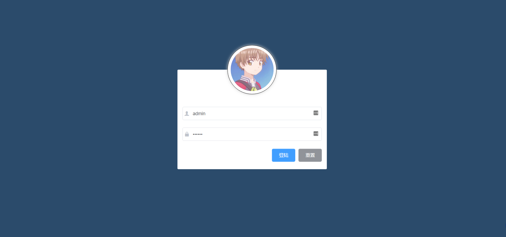
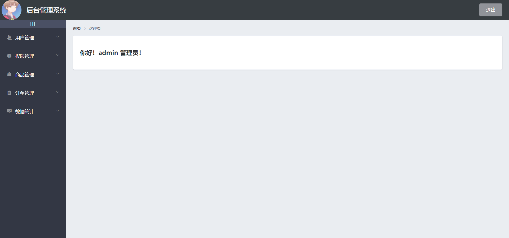
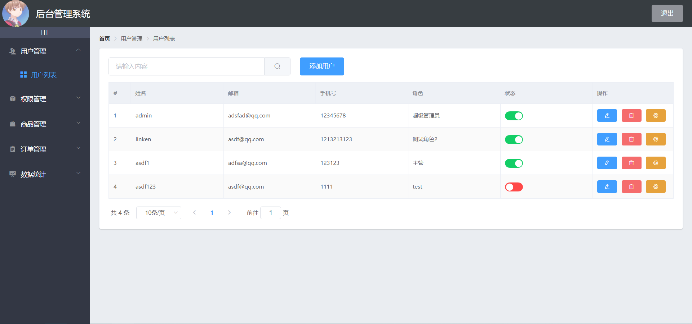
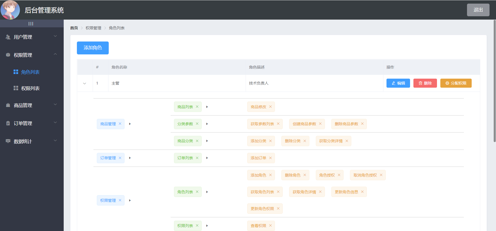
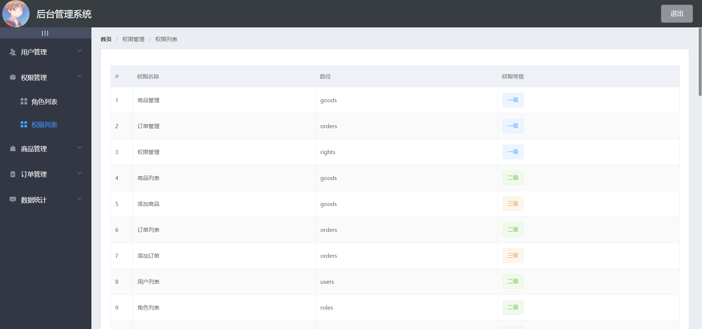
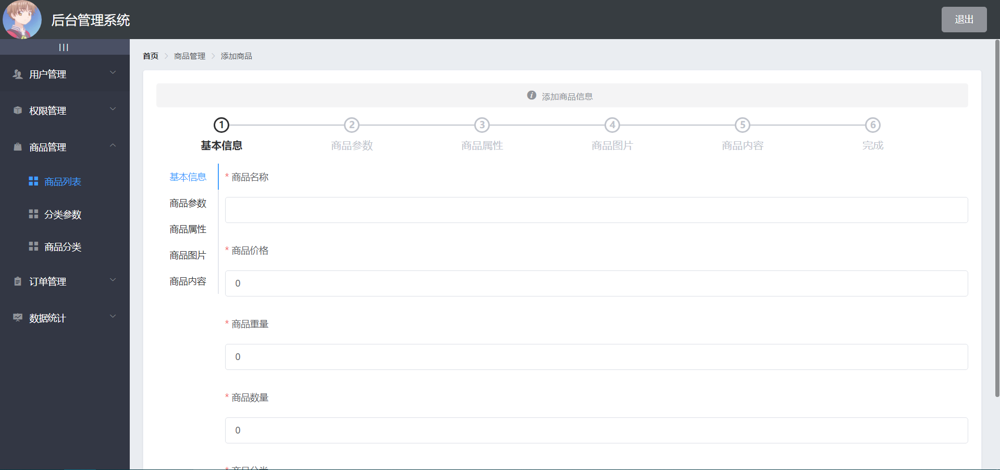
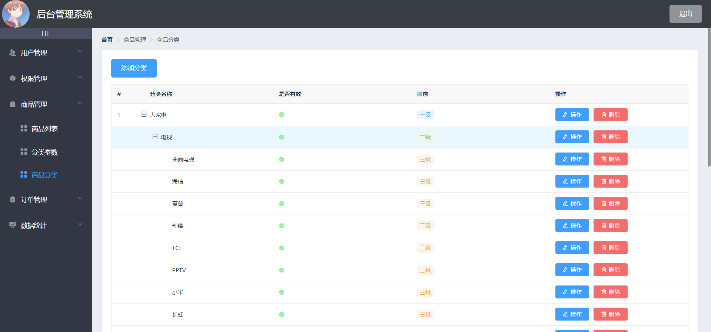
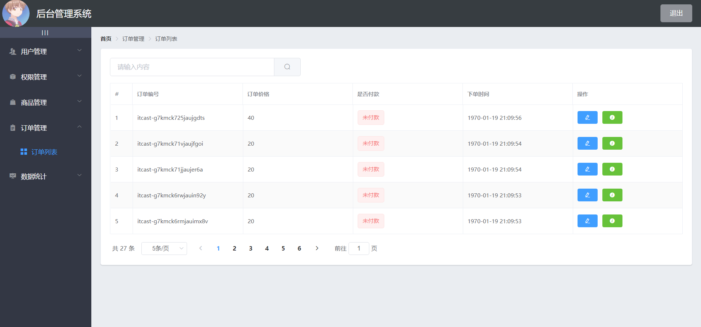
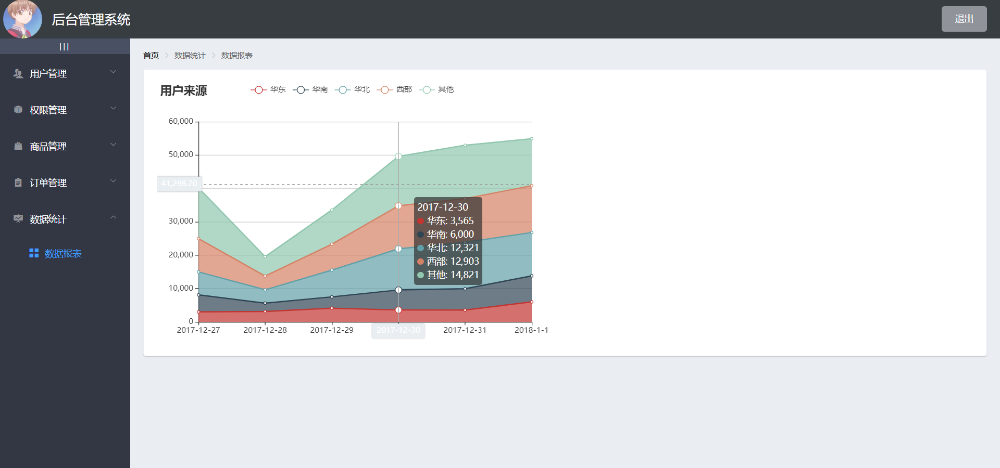

# vue_manage_system

## Project setup

```
npm install
```

### Compiles and hot-reloads for development

```
npm run serve
```

### Compiles and minifies for production

```
npm run build
```

### Lints and fixes files

```
npm run lint
```

### Customize configuration

See [Configuration Reference](https://cli.vuejs.org/config/).


# 后台管理系统

:zap:该系统采用前后端分离技术

:rainbow:前端：Vue的SPA(Single-Page Application)项目

:rainbow:技术栈：Vue+Vue-router+Element-UI+Axios+Echarts+富文本(quill-editor)

# 项目截图

#### 1.登录页



#### 2.欢迎页



#### 3.用户管理



#### 4.权限管理





#### 5.商品管理





#### 6.订单管理



#### 7.数据统计



## 前台初始化项目

- 配置Vue脚手架
- 配置Element-UI组件库
- 运行依赖Axios库
- git

## 后台初始化项目

- 安装phpStudy，只运行MySQL
- 解压vue_api_server，然后在MySQL管理器中导入mydb.sql，还原数据库
- 在vue_api_server中`npm install`安装依赖
- 运行API接口`node .\app.js`
- 测试API接口apipost
- `src/main.js`是整个项目的入口文件

### 1. 登录

1. 输入用户名、密码
2. 调用后台接口进行验证
3. 通过验证后，根据响应状态跳转到项目主页
   - 通过cookie在客户端记录状态【不存在跨域问题】
   - 通过session在服务器端记录状态【不存在跨域问题】
   - ★通过token方式维持状态【**存在跨域问题**】
     - token原理
4. 通过Element-UI组件实现布局


- 字体引用

```
首先需要导入到main.js中

import './assets/fonts/iconfont.css'

<el-input prefix-icon="iconfont icon-user"></el-input>
```

- 重置按钮

```
模板 ref=引用对象
<el-form ref="LoginFormRef">
<el-button @click="reset">重置</el-button>
<el-form>

<script>
export default {
  methods: {
    reset () {
      this.$refs.LoginFormRef.resetFields()
    }
  }
}
</script>
```

- 发起登陆请求需要axios

```
导入axios包
import axios from 'axios'
axios.defaults.baseURL = 'http://127.0.0.1:8888/api/private/v1/'
Vue.prototype.$http = axios	//挂载到Vue的原型对象上

出现Promise函数的话 就async await
this.$refs.loginFormRef.validate(async (valid) => {
	if (!valid) { return };
	const { data: res } = await this.$http.post('login', this.loginForm)
	if (res.meta.status !== 200) return this.$message.error('登陆失败')
	this.$message.success('恭喜您，登陆成功！')
})
__{data:res}__解构赋值把data属性单独领出来，赋值给res
```

- 消息提示（弹窗）

```
导入
import { Message } from 'element-ui'
!!需要挂载！！
Vue.prototype.$message = Message
这样做是因为可以每个组件就可以通过this.$message访问这个弹窗提示

if (res.meta.status !== 200) return this.$message.error('登陆失败')
this.$message.success('恭喜您，登陆成功！')
```

- 登录成功过后的token保存在客户端的SessionStorage中

```
window.sessionStorage.setItem('token', res.data.token)
```

- 通过`编程式导航【router】`跳转到后台主页

```
this.$router.push('/home')
```

- 路由导航守卫控制访问权限

就是不登录 不能显示登录后的页面，强制跳转回登录页

1. to将要访问的路径
2. from从哪个路径跳转过来
3. next()放行
   - next('/login')强制跳转

```
//为路由对象添加beforeEach导航守卫
router.beforeEach((to,from,next)=>{
//如果用户从登录页登陆，直接放行
if(to.path==='/login') return next()
//从sessionStroage中获取token值
const tk = window.sessionStorage.getItem('token')
//没有token值，强制跳转到登录页
if(!tk) return next('/login')
next()
})
```

### 2. 退出

只需要销毁本地token值

```
//清空token值
window.sessionStorage.clear()
//跳转到登录页
this.$router.push('/login')
```

### 3.主页布局


```
<el-container>
//头部区域
  <el-header>Header</el-header>
  <el-container>
  //侧边栏区域
    <el-aside width="200px">Aside</el-aside>
  //主体区域
    <el-main>Main</el-main>
  </el-container>
</el-container>
```

- 左右布局（Flex）

  - 左右贴边对齐

  ```
  display: flex;
  justify-content: space-between;(左右贴边对齐)
  align-items: center;(上下居中对齐)
  ```
  
- 嵌套Flex布局

  - 图片在el-header中已经进行flex布局，已经进行左右贴边对齐justify-content: space-between;
  - 文字旁边的文字，想要达到与图片居中对齐，可以设置字体span标签的flex布局 在跟一个align-items: center; 居中对齐

  ```
  .el-header {
    display: flex;
    justify-content: space-between;(左右贴边对齐)
    align-items: center;
    > div {
      display: flex;
      align-items: center;
    }
  }
  ```

  

#### 1. 左侧菜单布局

  - 菜单分为二级，可以折叠
      - `slot`是插槽

  ```
  <el-menu>
  	<el-submenu>
  	//一级菜单
  	<i class="el-icon-menu"></i>
  	<span>一级菜单</span>
  	//在一级菜单中嵌套二级菜单
  	<el-menu-item>
  		<i class="el-icon-menu"></i>
  		<span slot="title">二级菜单</span>
  	</el-menu-item>
  	</el-submenu>
  </el-menu>
  ```

- 通过接口获取菜单数据

  - 通过axios请求拦截器添加token，在挂载之前进行预处理

    需要授权API，请求头中使用authorization字段提供token【在请求的时候，进行预处理】

  ```
  //axios预处理
  //拦截器[interceptors]请求拦截器[request]挂在函数[use]
  axios.interceptors.request.use(config=>{
  	//添加token验证的authorization字段
  	config.headers.Authorization = window.sessionStorage.getItem('token')
  	return config
  })
  ```

  - 获取所有菜单

  ```
  <script>
  export default {
    	data() {
      	return {
       	menuList: []
      	}
    	},
    	// 页面加载完成，就获取数据
   	created() {
      this.getMenuList()
    },
      methods: {
      async getMenuList() {
      // 解构赋值
        const { data: res } = await this.$http.get('menus')
        if (res.meta.status !== 200) return this.$message.error(res.meta.msg)
        this.menuList = res.data
        console.log(res)
      }
    }
  }
  ```

  - UI绘制（双重for循环）

  ```
  //外层for循环渲染一级菜单
  <el-submenu :index="item.id+''" v-for="item in menuList" :key="item.id">
  <span>{{item.authName}}</span>
  
  //内层for循环渲染二级菜单
  <el-menu-item :index="subitem.id+''" v-for="subitem in item.children" :key="subitem.id">
  <span>{{subitem.authName}}</span>
  ```

  - 每一个一级菜单 文字前面的图标不同

    - 解决方案：
      1. 因为每个一级菜单是通过for循环自动生成，修改图标 是利用对象的键值对来解决
      2. 每一项的id作为key，值作为图标

    ```
    // 一级菜单图标动态变化
      <i :class="iconList[item.id]"></i>
    
    data () {
        return {
          // 导航栏数据
          menuList: [],
          iconList: {
            125: 'iconfont icon-user',
            103: 'iconfont icon-tijikongjian',
            101: 'iconfont icon-shangpin',
            102: 'iconfont icon-danju',
            145: 'iconfont icon-baobiao'
          }
        }
      },
    ```

  - 每个边框线没有对齐，有瑕疵

    - 用调试工具查看，可以看到是el-menu有边框的问题，变成none即可

      ```
      .el-menu {
        border: none;
      }
      ```

  - 字间距：

    ```
    letter-spacing:0.2em
    ```

  - SPA，单页面模式，在指定的区域显示不同的内容（路由占位符）

    - 在父路由（index）下设置一个children子路由规则，嵌套显示一个（Welcome）组件

    - 新建一个Welcome的vue文件

    - 在router的index.js中设置 :star:children属性是一个**数组**

      ```
      const routes = [
        {
          path: '/index',
          component: index,
          redirect: '/welcome',
          children:
          [{ path: '/welcome', component: welcome }]
        }
      ]
      ```

    - 在index父级文件中填写路由占位符 <router-view></router-view>

  - 为每一个菜单增加点击router事件

    - 为整个侧边栏开启路由模式[是否使用 vue-router 的模式，启用该模式会在激活导航时以 index 作为 path 进行路由跳转]

  ```
  <el-menu :router="true"></el-menu>
  ```

#### 2.用户列表

- 建立自己的文件夹

- 导入路由，放在`home`下（子路由）

- :star:解决高亮显示的BUG

  - 再点击每个二级菜单的时候不能显示激活状态

    - 把对应的地址保存到相对应的SessionStorage中 刷新页面的时候 从SessionStroage中取值 处在激活状态

    ```
    // 一级菜单
    <el-menu  :default-active="activePath">
    
    // 二级菜单
    <el-menu-item :index="'/'+subItem.path"
    			 @click="saveNavState('/'+subItem.path)">
    </el-menu-item>
    
    
    <script>
    export default {
      created () {
        this.activePath = window.sessionStorage.getItem('activePath')
      },
      data () {
        return {
          // 当前激活状态
          activePath: ''
        }
      },
      methods: {
        // 保存当前激活状态
        saveNavState (activePath) {
          window.sessionStorage.setItem('activePath', activePath)
      this.activePath = activePath
        }
      }
    }
    </script>
    ```
    
    
##### 2.1 搜索框&添加用户按钮

- 用Element-UI模板
- 面包屑导航

```
    <!-- 面包屑导航 -->
    <el-breadcrumb separator-class="el-icon-arrow-right">
      <el-breadcrumb-item :to="{ path: '/index' }">首页</el-breadcrumb-item>
      <el-breadcrumb-item>用户管理</el-breadcrumb-item>
      <el-breadcrumb-item>用户列表</el-breadcrumb-item>
    </el-breadcrumb>
```

- 用:span 进行划分栅格

```
<el-row :gutter="20">
	<el-col :span="8">
		XXX
	</el-col>
	<el-col :span="4">
		XXX
	</el-col>
</el-row>
```

- 为表格渲染数据

```
	<!-- 表格 -->
<el-table :data="userList"
		   stripe
		   border
		   style="width: 100%">
		   
	// index索引列
	<el-table-column type="index">
	</el-table-column>
	// 姓名列
	<el-table-column prop="username"
	label="姓名"></el-table-column>
      
</el-table>
      
      
<script>
export default {
  data () {
    return {
      queryInfo: {
        query: '',
        pagenum: 1,
        pagesize: 20
      },
      userList: [],
      total: 0

    }
  },
  created () {
    // 页面加载的时候调用函数
    this.getUserList()
  },
  methods: {
    async getUserList () {
      const { data: res } = await this.$http.get('users', { params: this.queryInfo })
      console.log(res)
      if (res.meta.status !== 200) return this.$message.error(res.meta.msg)
      this.$message.success(res.meta.msg)
      this.userList = res.data.users
      this.total = res.data.total
    }
  }
}
</script>
```

- 渲染true和false为按钮

  - 采用作用域插槽

    ```
    <!-- 状态列 -->
    	<el-table-column prop="mg_state"
    					 label="状态">
    					 
    		<!-- 作用域插槽 -->
    		<template slot-scope="scope">
    			<el-switch v-model="scope.row.mg_state" @change="switchChange(scope.row)">
                </el-switch>
    		</template>
    		
    </el-table-column>
    ```

  - 把switch改变值的传入到数据库内的方法：

    ```
     methods: {
    // Switch改变的时候
        async switchChange (newScope) {
          console.log(newScope)
          const { data: res } = await this.$http.put(`users/${newScope.id}}/state/${newScope.mg_state}`)
          console.log(res)
          if (res.meta.status !== 200) return this.$message.error(res.meta.msg)
          this.$message.success(res.meta.msg)
        }
      }
    }
    </script>
    ```

- 搜索框进行数据的筛选

```
<el-input placeholder="请输入内容"
			v-model="queryInfo.query"	//双向数据绑定v-model
			clearable					//清空属性
			@clear="getUserList">		//点击清空时，调用的事件就是获取用户列表事件
<el-button slot="append"
			icon="el-icon-search"
			@click="getUserList"></el-button>	//点击事件后获取数据
```

- 添加用户按钮

```
<el-form :model="addForm"						//数据绑定到addForm{添加用户的表单数据}
                 :rules="addFormRules"			//验证规则{username:[{验证1},{验证2}]}
                 ref="addFormRef"				//引用名称
                 label-width="70px">
                 
<!-- 【弹出对话框--用户名】prop="name"是验证规则内的属性 -->
<el-form-item label="用户名"
	prop="username">								//验证规则的属性【prop】一定在rules内部
	<el-input v-model="addForm.username"></el-input>
</el-form-item>

</el-form>
```

- :star:自定义校验规则（邮箱、手机号）

  - 第一步：定义一个箭头函数  `在data内的return之前`
  - 第二步：在具体规则rules中[{validator:指向箭头函数名，trigger:'blur'(触发时机)} ]
  - 验证是否符合校验规则（正则表达式.test(value)）

  ```
  <script>
  export default {
    data () {
      // 验证邮箱的规则(规则，待校验的值，回调函数)
      var checkEmail = (rule, value, callback) => {
        // 通过正则表达式
        const regEmail = /^[a-zA-Z0-9_.-]+@[a-zA-Z0-9-]+(\.[a-zA-Z0-9-]+)*\.[a-zA-Z0-9]{2,6}$/
        if (regEmail.test(value)) {
          return callback()// 校验成功
        }
        callback(new Error('请输入合法的邮箱'))
      }
  
      // 校验手机号的规则
      var checkPhone = (rule, value, callback) => {
        // 通过正则表达式
        const regPhone = /^(13[0-9]|14[5|7]|15[0|1|2|3|4|5|6|7|8|9]|18[0|1|2|3|5|6|7|8|9])\d{8}$/
        if (regPhone.test(value)) {
          return callback()// 校验成功
        }
        callback(new Error('请输入合法的手机号'))
      }
      
      return {
        // 添加用户表单
        addForm: {
          email: '',
          phone: ''
        },
        // 验证规则
        addFormRules: {
          email: [{ required: true, message: '请输入邮箱', triggle: 'blur' }, 
          { validator: checkEmail, triggle: 'blur' }],
          phone: [{ required: true, message: '请输入邮箱', triggle: 'blur' }, 
          { validator: checkPhone, triggle: 'blur' }]
  
        }
      }
    },
  ```

- 重置提交用户操作

  - 在添加用户输入框内，总是初始状态
  - 方法：在关闭窗口（Dialog关闭事件）的时候，重置表单（添加到methods方法内）
    - 第一步：为el-dialog添加事件`@close="closeDialogEvent"`
    - 第二步：在el-form中添加引用`ref="addFormRef"`
    - 第二步：重置 需要ref的引用，调用resetFields()重置表单方法

  ```
   <el-dialog title="添加用户"
   			@close="closeDialogEvent">
   			
   	<el-form ref="addFormRef">	//表单需要引用
   </el-dialog>
   
   <script>
  export default {
  	methods:{
  		// 监听关闭dialog事件 就触发
  		closeDialogEvent(){
  			this.$refs.addFormRef.resetFields()	//引用的表单调用resetFields()重置表单方法
  		}
  	}
  }
  ```

- 在提交表单的时候进行`预验证`

  - 为`提交`按钮，绑定事件处理函数`@click='addUser'`
  - 写在methods内，同样也需要引用表单.validate方法【valid是判断是否正确，符合规则】

  ```
   <el-button type="primary"
                     @click="addUser">确 定</el-button>
  
  <script>
  export default {
   methods: {
      addUser () {
        this.$refs.addFormRef.validate(valid => {
          console.log(valid)
          if (!valid) return this.$message.error('预验证失败！')
          this.$message.success('预验证成功')
        })
      }
   }
  ```

- 修改用户数据

  - 点击弹出dialog
  - 绑定事件
    - 在模板template中 `slot-scope="scope"` 传递给方法一个ID值
    - 根据 ID查询用户信息 有API 根据API获取信息
  - 添加事件、规则

  ```
  <template>
    <div>
  	<!-- 编辑用户dialog -->
      <el-dialog title="编辑用户"
                 :visible.sync="editUserDialog">
        <el-form :model="editForm"			
                 :rules="editFormRules"		//★★el-form中有rules规则对象
                 ref="editFormRef"			//★★el-form中有ref引用对象
                 label-width="70px">
          <!-- 【弹出对话框--用户名】 -->
          <el-form-item label="用户名">
            <el-input v-model="editForm.username"
                      disabled></el-input>
          </el-form-item>
          <!-- 【弹出对话框--邮箱】 -->
          <el-form-item label="邮箱"
                        prop="email">			//★★el-form-item中有prop传入对象
            <el-input v-model="editForm.email"></el-input>
          </el-form-item>
          <!-- 【弹出对话框--手机号】 -->
          <el-form-item label="手机号"
                        prop="mobile">
            <el-input v-model="editForm.mobile"></el-input>
          </el-form-item>
        </el-form>
        <!-- 底部按钮区域 -->
        <span slot="footer">
          <el-button @click="editUserDialog = false">取 消</el-button>
          <el-button type="primary"
                     @click="editUser">确 定</el-button>		//修改数据，点击后修改
        </span>
      </el-dialog>
    </div>
  </template>
  
  <script>
  export default {
  data () {
  // 验证邮箱的规则
  	var checkEmail = (rule, value, callback) => {
  // 通过正则表达式
  const regEmail = /^\w+([-+.]\w+)*@\w+([-.]\w+)*\.\w+([-.]\w+)*$/
  	if (regEmail.test(value)) {
  		return callback() // 校验成功
  	}
  	callback(new Error('请输入合法的邮箱'))
  }
  
  // 校验手机号的规则
  var checkMobile = (rule, value, callback) => {
  // 通过正则表达式
  const regMobile = /^(13[0-9]|14[5|7]|15[0|1|2|3|4|5|6|7|8|9]|18[0|1|2|3|5|6|7|8|9])\d{8}$/
  	if (regMobile.test(value)) {
  		return callback() // 校验成功
  	}
  	callback(new Error('请输入合法的手机号'))
  }
  
       return {
  // 编辑用户表单
  editForm: {},
  // 编辑用户验证规则
  editFormRules: {
  email: [{ required: true, message: '请输入邮箱', triggle: 'blur' }, 
  		{ validator: checkEmail, triggle: 'blur' }],
  mobile: [{ required: true, message: '请输入手机号', triggle: 'blur' }, 
  		{ validator: checkMobile, triggle: 'blur' }]
        }
      }
  },
    
  methods: {
  // 展示编辑用户的对话框
  async showEditUserDialog (id) {
  	this.editUserDialog = true
  },
  // 监听关闭编辑dialog事件 重置 就触发
  closeEditDialogEvent () {
  	this.$refs.editFormRef.resetFields()
  },
  editUser (editInfo) {
  	this.$refs.editFormRef.validate(async valid => {
  	if (!valid) return
  	const { data: res } = await this.$http.put('users/' + this.editForm.id, { email: this.editForm.email, mobile: this.editForm.mobile })		//axios请求地址，id为this.editForm对应的id 后面传入的是参数
  	if (res.meta.status !== 200) return this.$message.error('更新用户数据失败！')
  // 关闭dialog对话框
  	this.editUserDialog = false
  // 获取列表
  	this.getUserList()
  // 提示信息成功
  	this.$message.success('更新用户数据成功！')
  	})
  },
  // 调用接口获取信息
  const { data: res } = await this.$http.get(`users/${id}`)
  if (res.meta.status !== 200) return this.$message.error('查询用户信息失败！')
  this.$message.success('获取用户信息成功！')
  	this.editForm = res.data
      }
    }
  }
  ```

- 删除用户

  - 弹出MessageBox 弹框
  
  - Vue项目刷新弹出空白框
  
    ```
    其中 Message组件与MessageBox组件全局使用比较频繁，挂在到Vue的原型上比较方便，不要使用use。
    ```
  
    
  
  - 取消按钮，取消删除操作 确认按钮，进行删除操作(对删除按钮添加事件 并且注册方法)
  
  ```
  //挂载$confirm
  //导入Element-UI
  import { MessageBox } from 'element-ui'
  Vue.prototype.$confirm = MessageBox.confirm
  
  <!-- 删除 -->
  <el-tooltip effect="dark"
  			content="删除"
  			placement="top-start"
  			:enterable="false">
  <el-button type="danger"
  		@click="removeUserById(scope.row.id)"			//获取这个需要删除的ID值
  		icon="el-icon-delete"
  		size="mini"></el-button>
  </el-tooltip>
  
  方法内
  // 删除数据 提示框
  async removeUserById (id) {
  	const confirmResult = await this.$confirm('此操作将永久删除该文件, 是否继续?', '提示', {
  	confirmButtonText: '确定',
  	cancelButtonText: '取消',
  	type: 'warning'
  }).catch(err => err) // .catch用来捕获之前的所有错误
  // 用户确认删除 返回值为confirm
  // 用户取消删除 返回值为报错信息.catch(err=>err) 这个捕获到错误信息后，并且return回去，留下的只有cancel
if (confirmResult !== 'confirm') return this.$message.info('用户取消了删除操作')
  const { data: res } = await this.$http.delete('users/' + id)
  if (res.meta.status !== 200) return this.$message.error('删除信息失败！')
  this.$message.success('成功删除！')
  this.getUserList()
  }
  ```
  
  

##### 2.2 用户列表数据

- 首先进行书整体的data()，created()，methods()
- 在created()完后就应该调用相应的方法getUserList()
- 写方法，通过get请求 携带参数params这个参数的内容需要写到data数据内
- get方法得到的是Promise函数 需要async await 并且解构赋值
- 解构赋值出来的res可以看到所有get请求到的数据
- 在data数据内添加 用户列表userList和总数total 并且通过res赋值

```
<script>
export default {
  data () {
    return {
      // 获取用户列表的参数对象
      queryInfo: {
        query: '',
        pagenum: 1,
        pagesize: 2
      },
      userList: [],
      total: 0
    }
  },
  created () {
    this.getUserList()
  },
  methods: {
    async getUserList () {
      // get参数用params传递
      const { data: res } = await this.$http.get('users', {
        params: this.queryInfo
      })
      if (res.meta.status !== 200) { return this.$message.error('请求出错') }
      this.userList = res.data.users
      this.total = res.data.total
      console.log(res)
    }
  }
}
</script>
```

##### 2.3 数据改造 true 改为开关


###### ★`slot-scope`作用域插槽是用来传递这个作用域内的数据

```
<el-table-column prop="mg_state" label="状态">
	<template slot-scope="scope">
	          <el-switch v-model="scope.row.mg_state"	//获取这个数据
                       active-color="#13ce66"
                       inactive-color="#ff4949">
            </el-switch>
		{{scope.row}}	//当前这行的数据
	</template>
</el-table-column>
```

- switch在页面刷新的时候不会进行改变

  - 第一步：监听switch状态的改变[change]

  ```
  <el-switch v-model="scope.row.mg_state"
  				active-color="#13ce66"
  				inactive-color="#ff4949"
  				@change="userStateChanged(scope.row)">	//把数据也传入进来
  </el-switch>
      
      // 监听到
      userStateChanged (userinfo) {
        console.log(userinfo)		//可以监听到数据的改变
      }
  ```

  - 第二步：调用对应的API接口 保存到数据库内

  ```
  // 当switch改变的时候进行同步到数据库
  async userStateChanged (userinfo) {
  	console.log(userinfo)
  	const { data: res } = await this.$http.put(`users/${userinfo.id}/state/${userinfo.mg_state}`)
  	if (res.meta.status !== 200) {
  		userinfo.mg_state = !userinfo.mg_state
  		return this.$message.error('更改状态失败!')
  	}
  	this.$message.success('更改状态成功！')
  }
  ```

  

##### 2.4 操作框


- 操作很多按钮的时候，要在`template`中实现
- `slot-scope`作用域插槽

```
<template slot-scope="scope">
<!-- 修改 -->
              <el-button type="primary"
                         icon="el-icon-edit"></el-button>
<!-- 删除 -->
              <el-button type="danger"
                         icon="el-icon-delete"></el-button>
<!-- 设置 -->
              <el-button type="warning"
                         icon="el-icon-setting"></el-button>
</template>
```

##### 2.5 分页

- Element-UI套入

#### 3.权限管理

##### 3.1权限列表

- tag标签 通过不同的level进行不同的选择

```
v-if=
v-else if=
v-else
```

```
<template slot-scope="scope">
	<el-tag v-if="scope.row.level === '0'">一级</el-tag>
	<el-tag type="success" v-else-if="scope.row.level==='1'">二级</el-tag>
	<el-tag type="warning" v-else>三级</el-tag>
</template>
```


- 在操作很多按钮的时候 要在`template`中实现
- `slot-scope`作用域插槽

```
<template slot-scope="scope">
	<el-button icon="el-icon-edit"
				type="primary">编辑</el-button>
	<el-button icon="el-icon-delete"
				type="danger">删除</el-button>
	<el-button icon="el-icon-setting"
				type="warning">分配权限</el-button>
</template>
```

- ★修改长度应该在`el-table-column`表头进行统一设置 width=“300px”

##### 3.2添加用户

- 调试Element-UI

  - 1. 添加点击事件`@click="AddRoleDialog"`

    2. 在`el-dialog`中的`:visible.sync="showAddRoleDialog"`是用来接收初始（布尔值）值的。

    3. 定义一个`data`值 默认为关闭状态—>**false**

       ```
       data () {
           return {
             // 控制添加角色对话框的显示与隐藏
             showAddRoleDialog: false
         }
       }
       ```

    4. 点击事件对应的是`methods`方法，调用`data`属性变为显示状态—>**true**

       ```
       AddRoleDialog () {
             this.showAddRoleDialog = true
       }
       ```

    5. 在弹出框的`确定`和`取消`两个按钮中，`data`中的`showAddRoleDialog`还变成关闭状态—>**false**

       ```
       <el-button @click="showAddRoleDialog = false">取 消</el-button>
       <el-button type="primary"
       			@click="showAddRoleDialog = false">确 定</el-button>
       ```

       

```
<el-button type="primary"
			@click="AddRoleDialog">添加角色</el-button>		
                     
<!-- 添加角色 -->
<el-dialog title="提示"
			:visible.sync="showAddRoleDialog"
			width="50%">
<span>这是一段信息</span>
<span slot="footer"
class="dialog-footer">
<el-button @click="showAddRoleDialog = false">取 消</el-button>
<el-button type="primary"
			@click="showAddRoleDialog = false">确 定</el-button>
</span>
</el-dialog>


<script>
export default {
  data () {
    return {
      // 控制添加角色对话框的显示与隐藏
      showAddRoleDialog: false
    }
  },
  methods: {
    AddRoleDialog () {
      this.showAddRoleDialog = true
    }
  }
}
</script>
```

###### ★表单预验证

```
this.$refs.addRoleRefs.validate(valid => {
if (!valid) return this.$message.error('输入的格式不正确，请验证后重新输入!')	//验证不通过
	//验证通过继续下面的代码
}
```

##### ★3.3删除用户(MessageBox弹框)

- 弹出MessageBox 弹框
- 取消按钮，取消删除操作 确认按钮，进行删除操作(对删除按钮添加事件 并且注册方法)

```
//在element.js中导入Element-UI
import { MessageBox } from 'element-ui'
Vue.prototype.$confirm = MessageBox.confirm

//在methods方法内添加方法：
removeRoleById () {
	this.$confirm('此操作将永久删除该文件, 是否继续?', '提示', {
		confirmButtonText: '确定',
        cancelButtonText: '取消',
        type: 'warning'
	})
}

<!-- 删除 -->
<el-button type="danger"
		icon="el-icon-delete"
		size="mini"
		@click="removeUserById(scope.row.id)">//获取这个需要删除的ID值
</el-button>

// 继续编辑方法，删除数据
async removeRoleById (id) {
	const confirmResult = await this.$confirm('此操作将永久删除该文件, 是否继续?', '提示', {
	confirmButtonText: '确定',
	cancelButtonText: '取消',
	type: 'warning'
}).catch(err => err) // .catch用来捕获之前的所有错误
// 用户确认删除 返回值为confirm
// 用户取消删除 返回值为报错信息.catch(err=>err) 这个捕获到错误信息后，并且return回去，留下的只有cancel
if (confirmResult !== 'confirm') return this.$message.info('用户取消了删除操作')
const { data: res } = await this.$http.delete('users/' + id)
if (res.meta.status !== 200) return this.$message.error('删除信息失败！')
this.$message.success('成功删除！')
this.getUserList()
}
```

##### 3.4展开行操作

- 通过作用域插槽`slot-scope="scope"`实现

```
<template slot-scope="scope">

</template>
```

- 通过三次for循环渲染出来一级、二级、三级权限

  - 先确定位置 左边为一级权限 右边为二级三级权限 `栅格系统`[总共24格]

    ```
    <!-- 栅格系统 -->
    <el-row>
    	<!-- 一级权限 -->
    	<el-col :span="5"></el-col>
    	<!-- 二级、三级权限 -->
    	<el-col :span="19"></el-col>
    </el-row>
    ```


- 循环一级权限

  ```
  // v-for
  <li v-for="(item, index) in items">
  	
  </li>
  
  // 案例
  <!-- 栅格系统 -->
  <el-row v-for="(item1,index1) in scope.row.children"
  			:key="item1.id">
  <!-- 一级权限 -->
  <el-col :span="5">
  	<el-tag>{{item1.authName}}</el-tag>
  </el-col>
  ```

- 类名按需导入`:class="['bdbuttom',index===0?'bdtop':'']"`

```
<el-row :class="['bdbuttom',index1===0?'bdtop':'']"//绑定类名 按需绑定 看index是否为第一个孩子是的话显示类 不是的话为空
			v-for="(item1,index1) in scope.row.children"
			:key="item1.id">
```

- 防止页面刷新 导致展开的合上

```
// 更新列表 防止每次调用数据更新页面
// 用最新的data值赋值给role.children属性
role.children = res.data
```

##### 3.5分配权限（树形结构）

- 展开：树形结构进行分配权限

- 导入树形结构,在element.js中注册组件

```
 <el-tree :data="rightList"
               :props="treeProps"
               show-checkbox>		//添加复选框
</el-tree>
```

- 在每个复选框选中的时候 选中的是他的ID—>`node-key="id"`

```
 <el-tree node-key="id"></el-tree>
```

- 默认展开所有节点

```
 <el-tree default-expand-all></el-tree>
```

- 通过`:default-checked-keys="defkey"`把默认勾选的节点的 defkey的数组在点击`分配权限` 按钮的时候渲染到defkey数组中(只需要三级节点)

- 定义一个递归函数【递归函数：调用自己】

  - 把角色信息传递到递归函数中(node为节点，arr为数组)

  - 通过递归的形式 把三级节点的ID保存在`defkey`中

    ```
    methods:{
    	getAllInfo(node,arr){
    		if(!node.children){			//如果不存在node.children属性，则就是三级节点
    			return arr.push(node.id)	//把所有的id放在arr数组中
    		}
    		//如果此时没有return 则表示现在不是三级节点，继续循环 调用递归函数进行获取三级节点
    		//循环node中的所有数组
    		node.children.forEach(item => this.getAllInfo(item,arr))
    	}
    }
    ```

    - foreach循环

    ```
    arr.forEach(callback(currentValue [, index [, array]])[, thisArg])
    
    //每个孩子进行foreach循环，每拿到一项item 则继续调用函数
    node.children.forEach(item => this.getAllInfo(item,arr))
    ```

  - 修复BUG 每次关闭分配权限的时候，把`defkey`清空

- 分配权限 把勾选的权限赋值给同步到数据库内

  - 选中，半选中状态下，把所有的数据传递给一个数组
  - 需要调用方法`getCheckedKeys`和`getHalfCheckedKeys` 需要引用下才能调用方法
  - 获取到所有的keys后得到这样的结构 可以展示出来`[105, 116, 101, 104]`

  ```
  const keys = [...this.$refs.treeRefs.getCheckedKeys(), 		//展开运算符
  				...this.$refs.treeRefs.getHalfCheckedKeys()]
  ```

  - 以`,`分割为字符串

  ```
  const idStr = keys.join(',')
  ```

  - 进行传递参数

  ```
   const { data: res } = await this.$http.post(`roles/${this.roleId}/rights`, { rids: idStr })
  ```


#### 4.商品分类

- 面包屑导航

- 新的插件`vue-table-with-tree-grid` 与`<el-table>`类似

  ```
  //引入
  import TreeTable from 'vue-table-with-tree-grid'
  Vue.component('tree-table', TreeTable)		//tree-table 这个名字可以自己起 就是后来在这个模板内进行的定义
  
  //使用
   <tree-table :data="catList"
                    :columns="columns"
                    :show-index="true"
                    index-text="#"
                    :selection-type="false"
                    :expand-type="false"
                    class="treetable">
  <!-- 自定义模板渲染__是否有效 -->
          <template slot="isok"
                    slot-scope="scope">
            <i class="el-icon-success"
               style="color:lightgreen"
               v-if="scope.row.cat_deleted===false"></i>
            <i class="el-icon-error"
               style="color:red"
               v-else></i>
          </template>
          
  //在<script>中的表现
  <script>
  export default {
    data () {
      return {
        columns: [{
          label: '是否有效',			//该列的标签名
          prop: 'cat_deleted',	  //绑定到的数据属性名
          type: 'template',		  //类型 模板类型
          template: 'isok'		  // 表示模板的名称	
        }
    }
  }
  </script>
  ```

- 渲染分页管理（完整分页版）

```
<el-pagination @size-change="handleSizeChange"					//监听pagesize改变
                     @current-change="handleCurrentChange"		//监听pagenum改变
                     :current-page="queryInfo.pagenum"			//当前页
                     :page-sizes="[5, 10, 15, 20]"				//每页的多少
                     :page-size="queryInfo.pagesize"			//当前页面的大小pagesize
                     layout="total, sizes, prev, pager, next, jumper"
                     :total="total">
</el-pagination>
```

##### ★Tag标签内输入框自动获得焦点 

- `$nextTick`就是当页面内重新渲染元素的之后，才会调用的回调函数

```
      // 自动焦点到输入文本框
      this.$nextTick(_ => {
        this.$refs.saveTagInput.$refs.input.focus()
      })
```

- 去除字符串两端的空格`trim`

```
arr.trim()
```

#### 5.商品列表

##### ★5.1过滤器设置时间

- 在main.js中注册一个全局过滤器

```
// 第一个参数dateFormate为过滤器的名字，后面为过滤器的处理函数(需要处理的数据)
Vue.filter('dateFormate', function(originDate) {
  const dt = new Date(originDate)
  const year = dt.getFullYear()
  //字符串的方法 padStart(总共几位，不足的情况下就补什么字符串)Start在开始的位置补
  const month = (dt.getMonth() + 1 + '').padStart(2, '0')
  const date = (dt.getDate() + 1 + '').padStart(2, '0')

  const hours = (dt.getHours() + 1 + '').padStart(2, '0')
  const minutes = (dt.getMinutes() + 1 + '').padStart(2, '0')
  const seconds = (dt.getSeconds() + 1 + '').padStart(2, '0')

  return `${year}-${month}-${date} ${hours}:${minutes}:${seconds}`
})
```

- 调用过滤器 

```
<el-table-column prop="add_time"
                         label="创建时间">
          <template slot-scope="scope">
            {{scope.row.add_time | dateFormate}}
          </template>
        </el-table-column>
```

##### 5.2路由导航 去别的页面

- 可以直接跳转页面`http://localhost:8080/#/goods/add`

```
// 添加商品 通过路由导航去别的页面
goAddGoodPage () {
	this.$router.push('goods/add')
}
```

- 路由

```
import addGoods from '../components/goods/add.vue'
 { path: '/goods/add', component: addGoods }
```

##### 5.3 步骤条与tab栏互联

- 设置基本的步骤条

```
<!-- 步骤条 -->
<el-steps :space="200"
		  :active="activeIndex"		//需要绑定一个data属性的值 能够随时发生变化
		  finish-status="success">
	<el-step title="基本信息"></el-step>
				···
	<el-step title="完成"></el-step>
</el-steps>
```

- 设置基本的tab栏设置为左边 需要`:tab-position="'left'"`中间为`'left'`字符串格式

```
<!-- 左侧tab栏 -->
<el-tabs :tab-position="'left'"
		  v-model="activeIndex">
	<el-tab-pane label="基本信息">基本信息</el-tab-pane>
						···
	<el-tab-pane label="商品内容">商品内容</el-tab-pane>
</el-tabs>
```

- 联动【共用一个数据项`activeIndex`】

```
<!-- 步骤条 -->
<el-steps :space="200"
		  :active="activeIndex - 0"		//变成数字 隐式转换
		  finish-status="success">
     		···
</el-steps>

<!-- 左侧tab栏 -->
<el-tabs :tab-position="'left'"
		  v-model="activeIndex">			//连接data属性内的activeIndex
	<el-tab-pane 
		  name="0"	//自动与el-tabs中的v-model建立链接会把name中的值传入进去
		  name="1"
		  ···
		  name="9"
		  name="10"
	</el-tab-pane>
</el-tabs>


<script>
export default {
  data () {
    return {
      // 步骤条-到第几步
      activeIndex: '0'			//变成接收的字符串格式
    }
  },
  </script>
```

- 整个tabs为一个表单所包裹

```
<el-form>
	<el-tabs>
		<el-tab-pane>
			···
		</el-tab-pane>
	</el-tabs>
</el-form>
```

- Tag标签页切换触发的函数`before-leave`

```
<el-tabs :before-leave="beforeLeaveChange"> 	</el-tabs>

methods:{
    // 判断标签页进行切换
    beforeLeaveChange (activeName, oldActiveName) {
      console.log('即将离开的标签页为：' + oldActiveName)
      console.log('即将进入的标签页为：' + activeName)
      return false //就不能前往下一个标签页
    }
}
```

- 把字符串 分割 变成数组 
  - 每一次循环都能得到一个item项，这个item元素项的attr_vals是需要变化的字符串
  - 三元表达式 如果是空 就返回空数组 则以空格分割为数组

```
res.data.forEach(item => {
          item.attr_vals = item.attr_vals === 0 ? [] : item.attr_vals.split(' ')
})
```

#### 6. 上传图片

- `action`是对应的文档API地址
- 手动指定`headers`

```
 <el-upload :action="uploadURL"			//上传地址
			:on-preview="imgPreview"	//预览图片
			:on-remove="imgRemove"		//删除图片
			list-type="picture"			//以略缩图可操作模式进行展示
			:headers="headerObj"		//请求头属性
</el-upload>

data(){
	return{
	  // 图片上传地址
      uploadURL: 'http://127.0.0.1:8888/api/private/v1/upload',
        // 请求头地址
      headerObj: {
        Authorization: window.sessionStorage.getItem('token')
      }
	}
}
                       
```

- 上传成功 应该把该文件保存在需要整体打包上传的form表单中

```
<el-upload :action="uploadURL"
			:on-preview="imgPreview"
			:on-remove="imgRemove"
			list-type="picture"
			:headers="headerObj"
			:on-success="imgUploadSuccess">
</el-upload>


<script>
    // 图片上传成功
    imgUploadSuccess (response) {
      const imgInfo = { pic: response.data.tmp_path }
      this.addForm.pics.push(imgInfo)
      console.log(this.addForm)
    }
</script>
```

- 删除图片操作

  - 1、获取要删除的临时地址
  - 2、从pics数组中，找到这个图片对应的索引
  - 3、调用splice方法，移除

  ```
      imgRemove (file) {
        console.log(file)
        // 1、获取要删除的临时地址
        const removeImgAddress = file.response.data.tmp_path
        console.log(removeImgAddress)
        // 2、从pics数组中，找到这个图片对应的索引
        const index = this.addForm.pics.findIndex(item =>
          item.pic === removeImgAddress
        )
        // 3、调用splice方法，移除
        this.addForm.pics.splice(index, 1)
        console.log(this.addForm)
      },
  ```

- 整合提交表单信息

★loadsh进行深拷贝

- join是数组—>字符串

```
array.join(',')
```

- split字符串—>数组

```
str.split(' ')
```

- 通过编程式导航跳转到goods页面

```
// 编程式导航跳转到goods页面
this.$router.push('/goods')
```


#### 7. :bar_chart:Echarts

##### 7.1 安装运行依赖

​	在运行依赖中安装`echarts`

7.2 在Vue项目中配置Echarts

- 1. 【导入Echarts】在Script中导入Echarts

  ```
  <script>
  import echarts from 'echarts'
  </script>
  ```

- 2. 【为Echarts准备一个大小合适的容器】

  ```
  <template>
  <div>
  	
  	 <div id="main" style="width: 600px;height:400px;"></div>
  
  </div>
  </tempalte>
  ```

- 3. 初始化Echarts实例(在DOM元素渲染完毕后进行初始化实例Mounted)

     :star:下面的所有数据都放在Mounted数据下

  ```
  mounted(){
  	// 基于准备好的dom，初始化echarts实例
  	var myChart = echarts.init(document.getElementById('main'));
  }
  ```

- 4. 准备配置项和数据部分

     ```
      // 指定图表的配置项和数据
             var option = {
                 title: {
                     text: 'ECharts 入门示例'
                 },
                 tooltip: {},
                 legend: {
                     data:['销量']
                 },
                 xAxis: {
                     data: ["衬衫","羊毛衫","雪纺衫","裤子","高跟鞋","袜子"]
                 },
                 yAxis: {},
                 series: [{
                     name: '销量',
                     type: 'bar',
                     data: [5, 20, 36, 10, 10, 20]
                 }]
             };
     ```

- 5. 展示数据

  ```
   // 使用刚指定的配置项和数据显示图表。
          myChart.setOption(option);	//(option)是数据来源区域
  ```

  


#### 8.进度条

- 安装运行依赖`nprogress`
- 配置`main.js`

```
import NProgress from 'nprogress'
import 'nprogress/nprogress.css' // import styles

// 拦截器
axios.interceptors.request.use((config) => {
  NProgress.start()
  config.headers.Authorization = window.sessionStorage.getItem('token')
  return config
})
axios.interceptors.response.use((config) => {
  NProgress.done()
  return config
})
```

#### 9.项目优化

##### 9.1 build 编译的时候 取消所有的console

- 安装开发依赖`babel-plugin-transform-remove-console`
- 在`babel.config.js`中设置

```
// 发布阶段用到的移除所有console的插件
const prodPlugins = []
if (process.env.NODE_ENV === 'production') {
  prodPlugins.push('transform-remove-console')
}


module.exports = {
  presets: ['@vue/cli-plugin-babel/preset'],
  plugins: [
    ...prodPlugins
  ]
}

```


##### 9.2 生成打包报告

- 命令行格式

```
vue-cli-service build --report
```

- UI 运行`build`

##### 9.3 通过`vue.config.js`修改webpack的默认配置

```
  // 基础格式
module.exports = {
  // 选项...
}
```

- 因为开发和发布模式 公用一个main.js文件 所以需要分离
  - 开发模式的入口文件 src/mian-dev.js
  - 发布模式的入口文件 src/main-prod.js
    - 采用分离的方式：`configureWebpack`和`chainWebpack`
    - configureWebpack：通过`操作对象`的形式
    - chainWebpack：通过`链式编程`的形式
- 通过chainWebpack自定义打包入口

```
module.exports = {
  chainWebpack: (config) => {
    config.when(process.env.NODE_ENV === 'production', (config) => {
      config
        .entry('app')
        .clear()
        .add('./src/main-prod.js')
    })
    config.when(process.env.NODE_ENV === 'development', (config) => {
      config
        .entry('app')
        .clear()
        .add('./src/main-dev.js')
    })
  }
}
```

##### 9.4 通过external加载外部CDN资源

- 因为默认通过import语法导入的第三方依赖包，最终会打包合并到同一个文件中，导致过大

- 通过Webpack的externals节点，配置加载外部CND资源，配置的externals不会被打包
  - 在`vue.config.js` 发布模式中粘贴

  ```
        config.set('externals', {
          vue: 'Vue',
          'vue-router': 'VueRouter',
          axios: 'axios',
          lodash: '_',
          echarts: 'echarts',
          nprogress: 'NProgress',
          'vue-quill-editor': 'VueQuillEditor'
        })
  ```

  - 在发布模式的js文件中 删除默认引入的样式表.css

  - 在`publi/index.html`头部引用CND

  ```
        <!-- nprogress 的样式表文件 -->
        <link rel="stylesheet" href="https://cdn.staticfile.org/nprogress/0.2.0/nprogress.min.css" />
        <!-- 富文本编辑器 的样式表文件 -->
        <link rel="stylesheet" href="https://cdn.staticfile.org/quill/1.3.4/quill.core.min.css" />
        <link rel="stylesheet" href="https://cdn.staticfile.org/quill/1.3.4/quill.snow.min.css" />
        <link rel="stylesheet" href="https://cdn.staticfile.org/quill/1.3.4/quill.bubble.min.css" />
        <script src="https://cdn.staticfile.org/vue/2.5.22/vue.min.js"></script>
        <script src="https://cdn.staticfile.org/vue-router/3.0.1/vue-router.min.js"></script>
        <script src="https://cdn.staticfile.org/axios/0.18.0/axios.min.js"></script>
      <script src="https://cdn.staticfile.org/lodash.js/4.17.11/lodash.min.js"></script>
        <script src="https://cdn.staticfile.org/echarts/4.1.0/echarts.min.js"></script>
      <script src="https://cdn.staticfile.org/nprogress/0.2.0/nprogress.min.js"></script>
        <!-- 富文本编辑器的 js 文件 -->
      <script src="https://cdn.staticfile.org/quill/1.3.4/quill.min.js"></script>
        <script src="https://cdn.jsdelivr.net/npm/vue-quill-editor@3.0.4/dist/vue-quill-editor.js"></script>
  ```
  
  - 配置Element-UI
  
    - 在main-prod.js中 注释掉按需导入的代码
    - 在index.html头部区域，通过CDN加载Element-UI的JS和样式.
  
    ```
          <!-- element-ui 的样式表文件 -->
          <link rel="stylesheet" href="https://cdn.staticfile.org/element-ui/2.8.2/theme-chalk/index.css" />
          <!-- element-ui 的 js 文件 -->
          <script src="https://cdn.staticfile.org/element-ui/2.8.2/index.js"></script>
    ```
  
    
  
##### 9.5 首页内容的定制

  - 在`chainWebpack`进行定制

  ```
  module.exports = {
      chainWebpack:config=>{
          config.when(process.env.NODE_ENV === 'production',config=>{
              ......
              
              //使用插件
              config.plugin('html').tap(args=>{
                  //添加参数isProd
                  args[0].isProd = true
                  return args
              })
          })
  
          config.when(process.env.NODE_ENV === 'development',config=>{
              config.entry('app').clear().add('./src/main-dev.js')
  
              //使用插件
              config.plugin('html').tap(args=>{
                  //添加参数isProd
                  args[0].isProd = false
                  return args
              })
          })
      }
  ```

  - 在页面中 根据 `isProd`的值，渲染页面结构

  ```
   <title><%= htmlWebpackPlugin.options.isProd ? '' : 'dev - ' %>电商后台管理系统</title>
   
    <% if(htmlWebpackPlugin.options.isProd){ %>
      <!-- nprogress 的样式表文件 -->
      <link rel="stylesheet" href="https://cdn.staticfile.org/nprogress/0.2.0/nprogress.min.css" />
      ........
      <!-- element-ui 的 js 文件 -->
      <script src="https://cdn.staticfile.org/element-ui/2.8.2/index.js"></script>
      <% } %>
    </head>
  ```

  

##### 9.6 路由懒加载

- 安装开发依赖`@babel/plugin-syntax-dynamic-import`包
- 在`babel.config.js`配置文件中声明该插件

```
module.exports = {
  presets: ['@vue/cli-plugin-babel/preset'],
  plugins: [
	···
    ···,
    '@babel/plugin-syntax-dynamic-import'
  ]
}

```


- 将路由改为按需加载

  - 这个组名就是：’login_home_welcome‘

```
const Login = () => import(/* webpackChunkName:"login_home_welcome" */ './components/Login.vue')
```


```
// import orders from '../components/order/orders.vue'
const orders = () => import(/* webpackChunkName:"orders_reports" */ '../components/order/orders.vue')
// import reports from '../components/report/reports.vue'
const reports = () => import(/* webpackChunkName:"orders_reports" */ '../components/report/reports.vue')
// import goods from '../components/goods/goods.vue'
const goods = () => import(/* webpackChunkName:"goods_addGoods" */ '../components/goods/goods.vue')
// import addGoods from '../components/goods/add.vue'
const addGoods = () => import(/* webpackChunkName:"goods_addGoods" */ '../components/goods/add.vue')
// import categories from '../components/goods/categories.vue'
const categories = () => import(/* webpackChunkName:"categories_params" */ '../components/goods/categories.vue')
// import params from '../components/goods/params.vue'
const params = () => import(/* webpackChunkName:"categories_params" */ '../components/goods/params.vue')
// import rights from '../components/power/rights.vue'
const rights = () => import(/* webpackChunkName:"users_rights_roles" */ '../components/power/rights.vue')
// import roles from '../components/power/roles.vue'
const roles = () => import(/* webpackChunkName:"users_rights_roles" */ '../components/power/roles.vue')
// import users from '../components/user/users.vue'
const users = () => import(/* webpackChunkName:"users_rights_roles" */ '../components/user/users.vue')
// import welcome from '../components/welcome.vue'
const welcome = () => import(/* webpackChunkName:"login_home_welcome" */ '../components/welcome.vue')
// import home from '../components/home.vue'
const home = () => import(/* webpackChunkName:"login_home_welcome" */ '../components/home.vue')
// import login from '../components/login.vue'
const login = () => import(/* webpackChunkName:"login_home_welcome" */ '../components/login.vue')
```


​    


#### 10.项目上线

- 通过node创建web服务器

  - 创建node项目(创建一个新的server服务器)

    

    

  - 打开19-vue_manage_system_server 初始化包管理

    ```
    npm init -y
    ```

  - 安装express

    ```
    npm install express -S
    ```

  - 把dist目录复制到服务器中

  - 新建一个入口文件app.js

    - 初始化app文件

    ```
    const express = require('express')
    const app = express()
    
    app.use (express.static('./dist'))
    
    app.listen(80,()=>{
      console.log('成功运行！');
    })
    ```

  - 运行 node app.js 如果出现`运行成功！`则表示服务器启动成功【http://127.0.0.1】

- 开启gzip配置

  - 减小文件体积，传输速度更快

    - 安装包

    ```
    npm install compression -D
    ```

    - 导入包（在app.js中

    ```
    const express = require('express')
    const compression = require('compression')
    const app = express()
    
    // 一定要写在静态托管之前
    app.use(compression())
    app.use (express.static('./dist'))
    
    app.listen(80,()=>{
      console.log('成功运行！');
    })	
    ```

    

    - 启用中间件

- 配置https服务

  - http协议传输都是明文传输，不安全

  - https对传输协议进行加密，可以防止被中间人窃取，使用更安全

    - 申请SSL证书（https://freessl.cn/）

      ① 进入 https://freessl.cn/ 官网，输入要申请的域名并选择品牌。
      ② 输入自己的邮箱并选择相关选项。
      ③ 验证 DNS（在域名管理后台添加 TXT 记录）。
      ④ 验证通过之后，下载 SSL 证书（ full_chain.pem 公钥；private.key 私钥）。

      ```
       const https = require('https'); 
        const fs = require('fs'); 
        const options = { 
            cert: fs.readFileSync('./full_chain.pem'), 
            key: fs.readFileSync('./private.key') 
        } 
        https.createServer(options, app).listen(443); 
      ```

      

- 使用pm2管理应用

  ①在服务器中安装 pm2：npm i pm2 -g
  ② 启动项目：pm2 start 脚本 --name 自定义名称
  ③ 查看运行项目：pm2 ls
  ④ 重启项目：pm2 restart 自定义名称
  ⑤ 停止项目：pm2 stop 自定义名称
  ⑥ 删除项目：pm2 delete 自定义名称

