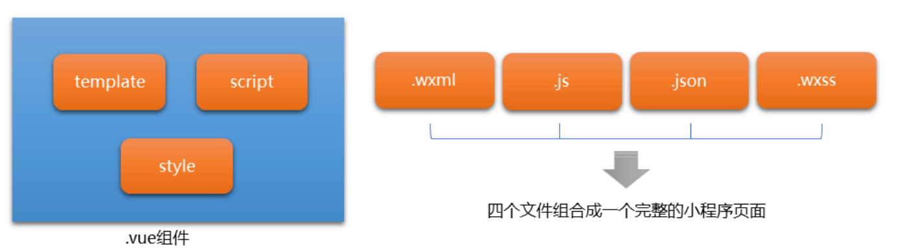
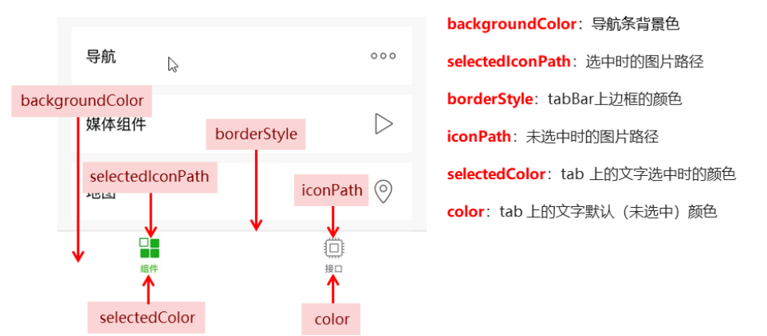

# 微信小程序

## API

1. 事件监听API
   - 以on开头 监听某件事件是否触发
2. 同步API
   - 以Sync结尾
   - 执行结果可以通过返回函数直接获得
3. 异步API（大多数）
   - 需要指定回调函数接收调用的结果


## 小程序结构

```javascript
├── pages ······································ 【目录】存放所有的小程序页面
│   │── index ···································· 【目录】index 页面
│   │   ├── index.wxml ······························· 【文件】 index 页面的结构
│   │   ├── index.js ································· 【文件】 index 页面的逻辑
│   │   ├── index.json ······························· 【文件】 index 页面的配置
│   │   └── index.wxss ······························· 【文件】 index 页面的样式
│   └── logs ····································· 【目录】 logs 页面
│       ├── logs.wxml ································ 【文件】 logs 页面的结构
│       └── logs.js ·································· 【文件】 logs 页面的逻辑
└── utils ······································ 【目录】 存放小程序中用到的工具函数
├── app.js ····································· 【文件】 小程序逻辑
├── app.json ··································· 【文件】 小程序的公共配置
├── app.wxss ··································· 【文件】小程序公共样式表
├── project.config.json ························ 【文件】 开发工具配置文件
```

说明：

-  `app.js` 是小程序的入口文件，运行小程序，第一个被运行的就是 `app.js`
-  `app.json` 是小程序的全局配置文件，对小程序每个页面生效 
-  `app.wxss` 是小程序的全局样式文件，对小程序每个页面生效

注意：

- 对于小程序运行而言，`app.js` 和 `app.json` 是必不可少的
-  对于小程序页面而言， `.js` 和 `.wxml` 文件是必不可少的




- `.wxml`当前页面的结构，提供类似Vue中的指令
- `.js`当前页面存放的数据、交互逻辑、响应用户操作
- `.json`当前页面的个性化配置
- `wxss`当前页面的样式表(css)


## 常用UI组件

### 1. text文本

```
// 行内组件 出现多个 在一行内进行显示
<text> </text>
```

| 属性名     | 类型    | 默认值 | 说明                                                         |
| ---------- | ------- | ------ | :----------------------------------------------------------- |
| selectable | Boolean | false  | 文本是否可选，默认**:no_entry_sign: 禁用**;除了text文本组件外，其他都不能长按选中 |
| space      | String  | false  | 显示连续空格，可选值：*ensp*(把每一个空格渲染成一个英文的长度)、*emsp*(把每一个空格渲染成一个汉字的长度)、*nbsp*(把每一个空格渲染成一个当前文字大小的长度) |
| decode     | Boolean | false  | 是否解码，可以解析例如：`&nbsp;`之类的                       |


### 2.view视图容器

```
// 类似与网页div 独占一行 外无margin 内无pandding
<view> </view>
```

| 属性名                 | 类型    | 默认值 | 说明                                     |
| ---------------------- | ------- | ------ | ---------------------------------------- |
| hover-class            | String  | none   | 指定按下去的样式类                       |
| hover-stop-propagation | Boolean | false  | 默认不会阻止冒泡，阻止祖先节点出现点击态 |
| hover-start-time       | Number  | 50     | 按住后多久出现点击态，单位：毫秒         |
| hover-stay-time        | Number  | 400    | 手指松开后点击态保留时间，单位：毫秒     |


### 3.button按钮

| 属性名  | 类型    | 默认值  | 说明                    |
| ------- | ------- | ------- | ----------------------- |
| size    | String  | default | 按键大小                |
| type    | String  | default | 样式类型                |
| plain   | Boolean | false   | 是否镂空，背景色透明    |
| disable | Boolean | false   | 是否禁用                |
| loading | Boolean | false   | 名称前是否带loading图标 |


### 4.input输入框

| 属性名      | 类型    | 默认值 | 说明                                   |
| ----------- | ------- | ------ | -------------------------------------- |
| value       | String  |        | 输入框的初始类型                       |
| type        | String  | 'text' | input输入框的类型                      |
| password    | Boolean | false  | 是否为密码类型                         |
| placeholder | String  |        | 输入框为空时占位符                     |
| disabled    | Boolean | false  | 是否禁用                               |
| maxlength   | Number  | 140    | 最大输入长度，当为-1时，不限制最大长度 |


### 5.image图片

```
<image> </image>
// 默认高度300px 高度225px
```

| 属性名 | 类型   | 默认值        | 说明                                         |
| ------ | ------ | ------------- | -------------------------------------------- |
| src    | String |               | 图片的资源地址，可以是本地，也可以是网络地址 |
| mode   | String | 'scaleToFill' | 图片剪裁、缩放模式                           |


## wxss

新增：

- 尺寸单位(rpx：微信小程序独有，解决屏幕自适应的尺寸单位)

  - 统一划分为750份
  - 以iPhone6为例 1rpx=0.5px=1物理像素 === 1px =2rpx
  - 在设计稿上的px单位 可以直接变成rpx单位，因为设计稿是二倍图，先÷2(二倍图)再×2(1rpx=0.5px)就是没变化

- 样式导入

  - @import样式导入

  ```
  @import "wxss的相对路径";
  ```

  

在使用属性选择器的时候，如果是属性选择器 一定要加`data-`开头

```
<view data-color="pink"></view>

[data-color="pink"] {
	background-color:pink
}
```


- 全局样式
  - `app.wxss`的样式为全局样式，作用每一个页面
- 局部样式
  - 在page的wxss文字中定义的样式为局部样式，覆盖`app.wxss`相同的选择器样式
  - 当局部样式>=全局才会生效


## app.json

小程序根目录下的`app.json`是全局配置，决定页面文件的路径、窗口表现、设置网络超时时间、设置多tab等

### 1. pages 数组 ：
:star: 用来配置小程序页面的路径

- 文件名不需要写后缀
- 快速新建文件

### 2. window 对象:

:star: 用来设置小程序的状态栏、导航栏、标题、窗口背景色


| 属性名                       | 类型     | 默认值  | 说明                                             |
| ---------------------------- | -------- | ------- | ------------------------------------------------ |
| navigationBarTitleText       | String   |         | 导航栏标题文字内容                               |
| navigationBarBackgroundColor | HexColor | #000000 | 导航栏背景颜色，如 `#000000`                     |
| navigationBarTextStyle       | String   | white   | 导航栏标题颜色，仅支持 `black` / `white`         |
| backgroundColor              | HexColor | #ffffff | 窗口的背景色                                     |
| backgroundTextStyle          | String   | dark    | 下拉 loading 的样式，仅支持 `dark` / `light`     |
| enablePullDownRefresh        | Boolean  | false   | 是否开启当前页面下拉刷新。                       |
| onReachBottomDistance        | Number   | 50      | 页面上拉触底事件触发时距页面底部距离，单位为px。 |
| backgroundTextStyle          | String   | dark    | 下拉 loading 的样式，仅支持 `dark` / `light`     |


### 3. tabBar对象：

:star: 用来配置小程序的tab栏效果

- 通常分为：`顶部tabBar`和`底部tabBar`
  - 渲染顶部tabBar的时候，不显示icon，只显示文本
- 最少2个，最多5个tabBar



| 属性            | 类型     | 必填 | 默认值 | 描述                                                       |
| --------------- | -------- | ---- | ------ | ---------------------------------------------------------- |
| color           | HexColor | 是   |        | tab 上的文字默认颜色，仅支持十六进制颜色                   |
| selectedColor   | HexColor | 是   |        | tab 上的文字选中时的颜色，仅支持十六进制颜色               |
| backgroundColor | HexColor | 是   |        | tab 的背景色，仅支持十六进制颜色                           |
| borderStyle     | string   | 否   | black  | tabbar 上边框的颜色， 仅支持 `black` / `white`             |
| list            | Array    | 是   |        | tab 的列表，详见 `list` 属性说明，最少 2 个、最多 5 个 tab |
| position        | string   | 否   | bottom | tabBar 的位置，仅支持 `bottom`/ `top`                      |


**list**

| 属性             | 类型   | 必填 | 说明                                                         |
| :--------------- | :----- | :--- | :----------------------------------------------------------- |
| pagePath         | string | 是   | 页面路径，必须在 pages 中先定义                              |
| text             | string | 是   | tab 上按钮文字                                               |
| iconPath         | string | 否   | 图片路径，icon 大小限制为 40kb，建议尺寸为 81px * 81px，不支持网络图片。 **当 `position` 为 `top` 时，不显示 icon。** |
| selectedIconPath | string | 否   | 选中时的图片路径，icon 大小限制为 40kb，建议尺寸为 81px * 81px，不支持网络图片。 **当 `position` 为 `top` 时，不显示 icon。** |


## page.json

**单个页面**的配置文件

页面级别的配置**优先于**全局配置

| 属性                         | 类型     | 默认值  | 描述                                         |
| ---------------------------- | :------- | :------ | :------------------------------------------- |
| navigationBarBackgroundColor | HexColor | #000000 | 导航栏背景颜色，如 `#000000`                 |
| navigationBarTextStyle       | string   | white   | 导航栏标题颜色，仅支持 `black` / `white`     |
| navigationBarTitleText       | string   |         | 导航栏标题文字内容                           |
| backgroundColor              | HexColor | #ffffff | 窗口的背景色                                 |
| backgroundTextStyle          | string   | dark    | 下拉 loading 的样式，仅支持 `dark` / `light`     |
| enablePullDownRefresh | boolean | false | 是否开启当前页面下拉刷新。      |
| onReachBottomDistance | number  | 50    | 页面上拉触底事件触发时距页面底部距离，单位为px。     |
| disableScroll | boolean | false | 设置为 `true` 则页面整体不能上下滚动。 只在页面配置中有效，无法在 `app.json` 中设置     |


## 生命周期

:one:**应用生命周期**：小程序从启动→运行→销毁的过程

:two:**页面生命周期**：小程序中，每个页面的加载→渲染→销毁的过程


## 生命周期函数

由小程序框架提供的内置函数，会随着生命周期，自动按次序执行

:one:**应用生命周期函数**：

:two:**页面生命周期函数**