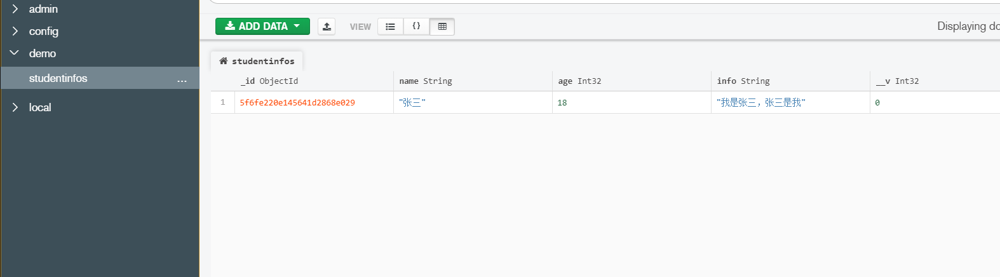

#　MongoDB

- 安装MongoDB
- 启动MongoDB 
  - 打开CMD
  - 启动服务 net strat mongodb
  - 终止服务 net stop mongodb

- 数据库的连接（mongoose）

  - 安装第三方包 

    ```
    npm install mongoose
    ```

  - 使用第三方 连接数据库

    ```
    const mongoose = require('mongoose');
    
    mongoose.connect('mongodb://localhost/demo')
            .then(()=>console.log('数据库连接成功！'))
            .catch(err=>console.log(err,'数据库连接失败！！'))
    ```


## 初始化

### 创建规则Schema

就是设置你要存储到数据库内什么类型的数据，做一个提前的规则描述

规则的名称`studentinfoSchema`

```
const studentinfoSchema = new mongoose.Schema({
    name:String,
    age:Number,
    info:String
})
```

### 应用规则

设置一个存储的数据库规则以后，需要把这个规则应用到studentinfo身上

数据库整个库的名称`studentinfos`

创建集合`model`方法

```
const student = mongoose.model('studentinfo',studentinfoSchema);
```


### 创建实例

实例化对象

- 方法一：

```
const zs = new student({
    name:'张三',
    age:18,
    info:'我是张三，张三是我'
})

zs.save()
```

- 方法二：

```
student.create({name:'李四',age:22,info:'这是另一种方法插入进来的数据！'},(err,result)=>{
    console.log(err);
    console.log(result);
})
```





## 增删改查

1. 向数据库内导入数据

   - 需要检查系统环境变量的Path里是否有`**\MongoDB\Server\**\bin`
   - 然后在终端内导入操作

   ```
   mongoimport -d 数据库名称 -c 集合名称 --file 文件来源
   ```

   

2. 查找数据

   - `find`方法与id相匹配的数据 并且返回**数组**

   ```
   student.find({_id:'xxxxxxx'}).then((result)=>console.log(result))
   ```

   - `findOne`方法，返回一条**对象**

   ```
   student.findOne({age:'22'}).then((result)=>console.log(result))
   ```

   - 匹配大于`$gt` 小于的数据`$lt`

   ```
   student.find({age:{$gt:20,$lt:50}}).then((result)=>console.log(result))
   ```

   - 包含`$in`

   ```
   student.find({age:{$in:20}}).then((result)=>console.log(result))
   ```

   - 选择要查询的字段 
     - 如果不想显示某个字段.select（'-age-info'）不显示

   ```
   student.find().select('age info').then((result)=>console.log(result))
   ```

   - 查询出来的数据进行排序 `.sort`（从小到大）

   ```
   student.find().sort('age').then((result)=>console.log(result))
   ```

   - 跳过`skip`和限制`limit`查询数量

   ```
   student.find().skip(2).limit(2).then((result)=>console.log(result))
   ```

   

3. 删除文档

   - 删除单个

   ```
   student.findOneAndDelete({查询条件}).then((result)=>console.log(result))
   ```

   - 删除多个

   ```
   student.deleteMany({查询条件}).then((result)=>console.log(result))
   ```

   

4. 更新文档

   - 更新单个

   ```
   student.updateOne({查询条件},{要修改的值}).then((result)=>console.log(result))
   ```

   - 更新多个

   ```
   student.updateMany({查询条件},{要修改的值}).then((result)=>console.log(result))
   ```


## 验证

在创建集合的时候，可以设置当前字段的验证规则，验证失败就插入失败

```
// 创建集合
const moneySchema = new mongoose.Schema({
  cost: {
  	type:Number,
  	required:true
  }
  type: String,
  info: {
  	type:String,							// 类型
  	require:true,							// 是否必填
  	minlength:[2,'信息不能少于2个字符'],		  // 最低长度
  	maxlength:[15,'信息不能超过15个字符'],	  // 最大长度
  	trim:true								// 去除字符串两边空格
  },
  time: {
  	type:Date,
  	default:Date.now,						// 默认当前时间
  	enum:['java','css','html'],				// 枚举 数组 如果传入的不是我传入的值 那么就验证失败  
  	author:{
  		type:String,
  		validata:{							// 自定义验证规则
  			validator:v=>{					// v就是用户传入的需要验证的值
  				//返回一个布尔值，true验证成功false验证失败
  				return v&&v.length>4
  			},
  			message:'传入的值不符合验证规则!'	//自定义错误信息
  		}
  	}
  }
})

// 使用规则
const CostMoney = mongoose.model('costmonylist',moneySchema);


// 创建文档
CostMoney.create({})
	.then(err=>console.log(err))
//什么也不插入，肯定报错 因为require是true必填选项
```

```
// 获取所有报错信息
CostMoney.create({})
	.then(err=>{
		const err = err.errors;
		for(var obj in err){
			console.log(err[obj]['message'])
		}
	})
```


## 集合关联

- 使用`_id`进行关联
- 使用方法`populate(填充)`方法进行关联集合查询

```
const mongoose = require('mongoose');

mongoose.connect('mongodb://localhost/demo',{ useNewUrlParser: true,useUnifiedTopology: true } )
        .then(()=>console.log('数据库连接成功！'))
        .catch(err=>console.log(err,'数据库连接失败！！'))

// 创建 author 规则
const authorSchema = mongoose.Schema({
  name:String
})

// 把规则应用到authorInfo
const author = mongoose.model('authorInfo',authorSchema)

// 实例化 author
// author.create({name:'张三'}).then(result=>console.log(result))

// 创建 book 规则
const bookSchema = mongoose.Schema({
  book_name:String,
  author:{
    // 固定格式
    type:mongoose.Schema.Types.ObjectId,
    // 从哪个表单引用ref(★是表单名 不是构造函数名)
    ref:'authorInfo'
  },
  publish:Number
})

// 应用 book 规则
const book = mongoose.model('bookInfo',bookSchema)

// 实例化 book 
// book.create({book_name:'自传',author:'5f7091cbda18d808b0c12447',publish:55})

// 因为author字段在创建的时候是一串ID,populate填充到'author'内
book.find().populate('author').then(result=>console.log(result))
```


## 案例：实现简单的增删改查功能

- 搭建网站服务器，实现客户端与服务器端的通讯

  - 用到http模块、creatServer创建服务器、listen监听服务器

  ```
  // 引入
  const http = require('http');
  
  // 创建服务器
  const app = http.creatServer();
  
  // 监听端口
  app.listen(3000);
  ```

  - 为服务器对象添加请求

  ```
  app.on('require',(res,req)=>{
  	res.end('ok')
  })
  ```

- 连接数据库，创建用户集合，向集合中插入文档

  - 引入第三方模块 mongoose

  ```
  const mongoose = require('mongoose')
  ```

  - 连接数据库

    - 默认连接端口是`27017`

    ```
    mongoose.connect('mongodb://localhost/simple_manage',{ useNewUrlParser: true, useUnifiedTopology: true  })
            .then(()=>console.log('连接数据库成功！'))
            .catch(()=>console.log('连接数据库失败！'))
    ```

    - 创建规则

    ```
    // 创建规则
    const spmSchema = mongoose.Schema({
      name:{
        type:String,
        require:true,
      },
      age:type:Number,
      password:type:String,
      email:String,
      hobbies:[String]
    })
    ```

    - 应用规则

    ```
    // 应用规则
    const simple_manage = mongoose.model('spmList',spmSchema)
    ```

    - 把数据导入数据库内

    ```
    PS E:\simple_manage> mongoimport -d simple_manage -c spmLists --file ./user.json
    2020-09-30T08:59:12.243+0800    connected to: localhost
    2020-09-30T08:59:12.454+0800    imported 6 documents
    ```

- 当用户访问/list时，将所有用户信息查询出来

  - 实现路由功能（获取到用户的请求方式和请求地址，进行判断）

    - 获取请求方式：

      ```
      app.on('request',async (req,res)=>{
      // 获取请求方式require 请求
      const method = req.method;
    })
      ```

    - 获取请求地址：

      :star:`req.url`存储的是带GET请求参数的请求地址

      获得纯粹的请求地址使用：:one:导入url模块:two:`url.parse(req.url)`进行处理，返回一个对象，进行结构赋值
    
      ```
      const url = require('url')
      
      // 获取请求地址 pathname
    const { pathname } = url.parse(req.url)
      ```

    - （路由功能）进行请求地址的判断
    
      ```
      // 为服务器对象添加请求事件
      app.on('request', async (req,res)=>{
      
        // 获取请求方式
        const method = req.method;
    
        // 请求地址
      const { pathname } = url.parse(req.url)
        
        //（路由功能）进行请求地址的判断
      if(method == 'GET'){
      
          // 判断是否是/list列表
          if(pathname == '/list'){
          	// 所有数据
            const allInfo = await simple_manage.find();
            console.log(allInfo);
            
            // 打开http://localhost:3000/list可以进行查看
            const list = `模板字符串 把网页源代码复制进来`
            res.end(list);
      	  }
      }else if(method =='POST'){
      
       }
          
      })
      ```
      
      

  ```
  
  ```

  

  - 呈现用户列表页面
  - 从数据库中查询用户信息，将用户信息展示出来

- 将用户信息和表格HTML进行拼接并将拼接结果响应回客户端

- 当用户访问/add时， 呈现表单页面，并实现添加用户信息功能

- 当用户访问/modify时， 呈现修改页面，并实现修改用户信息功能

- 当用户访问/delete时，实现用户删除功能