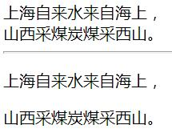
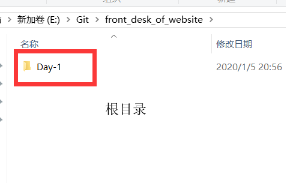
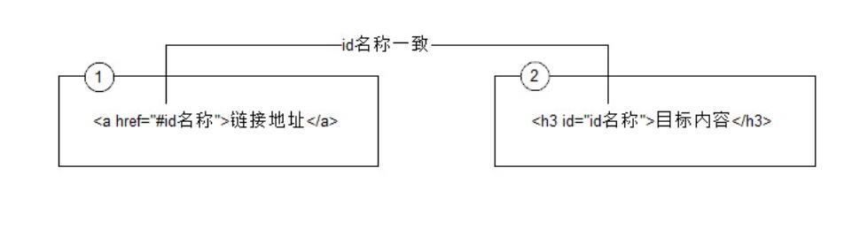

# Day-1

# 学习步骤
- HTML
- CSS
- Photoshop
- 品优购电商项目

# WEB标准  
- 网页中web标准三层组成  
**构成:** 主要包括`结构`(Structure)、`表现`(Presentation)和`行为`(Behavior)三个方面。

| 标准 | 说明                                                         | 备注                           |
| :--- | :----------------------------------------------------------- | :----------------------------- |
| 结构 | 结构用于对**网页元素**进行整理和分类，咱们主要学的是HTML。   |   |
| 表现 | 表现用于设置网页元素的版式、颜色、大小等**外观样式**，主要指的是CSS |     |
| 行为 | 行为是指网页模型的定义及**交互**的编写，咱们主要学的是 Javascript |  |
理想状态我们的源码:`.HTML` `.css` `.js`  
(Web标准不是某一个标准，而是由W3C组织和其他标准化组织制定的一系列标准的集合。)

为什么要遵循WEB标准呢？  
(通过以上浏览器不同内核不同，我们知道他们显示页面或者排版就有些许差异。)

# HTML 初识  
- HTML 指的是`超文本标记语言`(**H**yper **T**ext **M**arkup **L**anguage)是用来描述网页的一种语言。
- HTML 不是一种编程语言，而是一种标记语言 (markup language)
- 标记语言是一套标记标签 (markup tag)  

# html骨架标签
```html
<html>   
    <head>     
        <title></title>
    </head>
    <body>
    </body>
</html>
```

| 标签名              |   定义   | 说明                             |
| ---------------- | :----: | :----------------------------- |
| html和/html    | HTML标签 | 页面中最大的标签，我们成为  根标签             |
| head和/head   | 文档的头部  | 注意在head标签中我们必须要设置的标签是title     |
| titile和/title | 文档的标题  | 让页面拥有一个属于自己的网页标题               |
| body和/body   | 文档的主体  | 元素包含文档的所有内容，页面内容 基本都是放到body里面的 |
   

**约定:**
> HTML标签名、类名、标签属性和大部分属性值统一用`小写`
```
 <head>     
        <title>我的第一个页面</title>
 </head>
```
# HTML元素标签分类

**标签:**  
在HTML页面中，带有“< >”符号的元素被称为HTML标签，如上面提到的 &lt;html&gt;、&lt;head&gt;、&lt;body&gt;都是HTML骨架结构标签。

**分类:**  
1. 常规元素(双标签)
```html
<标签名> 内容 </标签名>   比如 <body>  我是文字  </body>
```
* 该语法中“<标签名>”表示该标签的作用开始，一般称为“开始标签(start tag)”，“</标签名>” 表示该标签的作用结束，一般称为“结束标签(end tag)”。
* 和开始标签相比，结束标签只是在前面加了一个关闭符“/”。
* 我们以后接触的基本都是双标签  

2. 空元素(单标签)
```html
<标签名 />  比如  <br />
```

# HTML标签关系
主要针对于**双标签** 的相互关系分为两种:  请大家务必熟悉记住这种标签关系，因为后面我们标签嵌套特别多，很容易弄混他们的关系。
1. 嵌套关系
```html
<head>  
	<title> </title> 
</head>
```

2. 并列关系
```html
<head></head>
<body></body>
```

**约定:**
> ```html
>  如果两个标签之间的关系是嵌套关系，子元素最好缩进一个tab键的身位(一个tab是4个空格)。如果是并列关系，最好上下对齐。
> ```

**vscode生成html骨架小技巧**
*  双击打开软件
*  新建文件(ctrl+n)
*  保存(ctrl+s),保存为:文件名.html(注意后缀名必须是`.html`)
*  放大缩小代码 按住 ctrl 在 滚动鼠标滚轮 或者 ctrl + 加号 键 和 ctrl + 减号键  
*  生成页面骨架结构
   - html: 5 按下tab键 或者
   - !    按下tab键
*  在浏览器中预览页面
   - 右键在  浏览器中打开

# 文档类型<!DOCTYPE>
```html
<!DOCTYPE html> 
```
**作用:**  
<!DOCTYPE> 声明位于文档中的最前面的位置，处于 <html> 标签之前。此标签可告知浏览器文档使用哪种 HTML 或 XHTML 规范。

# 页面语言lang
~~~html
<html lang="en">  指定html 语言种类
~~~
最常见的2个:
1. `en`定义语言为英语
2. `zh-CN`定义语言为中文
>  <html lang="zh-CN">  指定该html标签 内容 所用的语言为中文
**约定:**
> ```
> 考虑浏览器和操作系统的兼容性，目前仍然使用 zh-CN 属性值
> ```

# 字符集
~~~html
<meta charset="UTF-8" />
~~~
~~~
字符集(Character set)是多个字符的集合。

计算机要准确的处理各种字符集文字，需要进行字符编码，以便计算机能够识别和存储各种文字。
~~~
`UTF-8`是目前最常用的字符集编码方式，常用的字符集编码方式还有GBK和GB2312。
* GB2312 简单中文 包括6763个汉字(GB:国标的意思)  
* BIG5 繁体中文 港澳台等用  
* GBK包含全部中文字符 是GB2312的扩展，加入对繁体字的支持，兼容GB2312  
* UTF-8则基本包含全世界所有国家需要用到的字符  
* **这句代码非常关键，是必须要写的代码，否则可能引起乱码的情况。**

**约定:**
> ```
> 一般情况下统一使用 "UTF-8" 编码, 请尽量统一写成标准的 "UTF-8"，不要写成 "utf-8" 或 "utf8" 或 "UTF8"。
> ```

# HTML标签的语义化
白话: 所谓标签语义化，就是指标签的含义。  

**语义化目的:**
> 根据标签的语义，在合适的地方给一个最为合理的标签，让结构更清晰。
1. 方便代码的阅读和维护
2. 同时让浏览器或是网络爬虫可以很好地解析，从而更好分析其中的内容 
3. 使用语义化标签会具有更好地搜索引擎优化 

# HTML常用标签

## 标题标签h
> 标题标签(指的就是h)  
> 文档标题(title，网页名字)  

为了使网页更具有语义化，我们经常会在页面中用到标题标签，HTML提供了`6`个等级的标题  

**标题标签语义:**  作为标题使用，并且依据重要性递减，一行是只能放一个标题
```html
<h1>   标题文本   </h1>
<h2>   标题文本   </h2>
<h3>   标题文本   </h3>
<h4>   标题文本   </h4>
<h5>   标题文本   </h5>
<h6>   标题文本   </h6>
```


## 段落标签p
**段落标签语义:** 可以把 HTML 文档分割为若干段落，是HTML文档中最常见的标签，默认情况下，文本在一个段落中会根据浏览器窗口的大小自动换行。
```html
<p>  文本内容  </p>
```

## 水平线标签hr
**水平线标签语义:** 在网页中常常看到一些水平线将段落与段落之间隔开，使得文档结构清晰，层次分明。这些水平线可以通过插入图片实现，也可以简单地通过标签来完成，hr /就是创建横跨网页水平线的标签，在网页中显示默认样式的水平线。
```html
<hr />是单标签
```

## 换行标签br
**换行标签语义:** 在HTML中，一个段落中的文字会从左到右依次排列，直到浏览器窗口的右端，然后自动换行。如果希望某段文本强制换行显示，就需要使用换行标签
```html
<br />
```
**换行标签与段落标签区别:** 换行标签(br /)比段落标签(p)紧凑  
  

## div和span标签
```html
<div> div标签 </div>    <span>span标签</span>
```
* div标签 用来布局的，但是现在一行只能放一个div
* span标签 用来布局的，一行上可以放好多个span

## 排版标签总结
| 标签名        | 定义       | 说明                                  |
| ------------- | :--------- | :------------------------------------ |
| hx和/hx     | 标题标签   | 作为标题使用，并且依据重要性递减      |
| p和/p       | 段落标签   | 可以把 HTML 文档分割为若干段落        |
| hr /       | 水平线标签 | 没啥可说的，就是一条线                |
| br /       | 换行标签   |                                       |
| div和/div   | div标签    | 用来布局的，但是现在一行只能放一个div |
| span和/span | span标签   | 用来布局的，一行上可以放好多个span    |


## 文本格式化标签
在网页中，有时需要为文字设置粗体、斜体或下划线效果，这时就需要用到HTML中的文本格式化标签，使文字以特殊的方式显示。

  

**区别：**
b 只是加粗 || strong 除了可以加粗还有 强调 的意思，语义更强烈(使用更多)  
其他同理

## 标签属性
```html
<标签名 属性1="属性值1" 属性2="属性值2" …> 内容 </标签名>   //属性与属性之间用空格隔开
```

## 图像标签img
```html

```
该语法中src属性用于指定图像文件的路径和文件名，他是img标签的必需属性。


1. 标签可以拥有多个属性，必须写在开始标签中，位于标签名后面。  
2. 属性之间不分先后顺序，标签名与属性、属性与属性之间均以空格分开。  
4. 采取键值对的格式key="value"的格式  
```html
	正常的<br />
    <br />

     带有边框的<br />
    <br />

	有提示文本的<br />
    <br />
    
	有替换文本的<br />
	
```

## 链接标签
```html
<a href="跳转目标" target="目标窗口的弹出方式">文本或图像</a>
```

| 属性   | 作用                                                         |
| ------ | :----------------------------------------------------------- |
| href   | 用于指定链接目标的url地址，（必须属性）当为标签应用href属性时，它就具有了超链接的功能 |
| target | 用于指定链接页面的打开方式，其取值有`_self`和`_blank`两种，其中_self为默认值，__blank为在新窗口中打开方式。 |

1. 外部链接 需要添加 `http://`www.baidu.com
2. 内部链接 直接链接内部页面名称即可 比如 < a href="index.html"> 首页 </ a >
3. 如果当时没有确定链接目标时，通常将链接标签的href属性值定义为“#”(即href="#")，表示该链接暂时为一个空链接。
4. 不仅可以创建文本超链接，在网页中各种网页元素，如图像、表格、音频、视频等都可以添加超链接。
```html
    <a href="http://需要跳转网站地址">  </a>
```

## 注释标签
```html
    <!-- 注释语句 -->     快捷键是：    ctrl + /       或者 ctrl +shift + / 
```

# 路径
**根目录：**  
打开目录文件夹的第一层  就是 根目录 


## 相对路径
以引用文件之网页所在位置为参考基础，而建立出的目录路径。因此，当保存于不同目录的网页引用同一个文件时，所使用的路径将不相同，故称之为相对路径。  
| 路径分类   | 符号  | 说明                                                         |
| ---------- | :---: | :----------------------------------------------------------- |
| 同一级路径 |       | 只需输入图像文件的名称即可，如&lt;img src="baidu.gif" /&gt;。 |
| 下一级路径 |  “/”  | 图像文件位于HTML文件同级文件夹下（例如文件夹名称为：images）                         如&lt;img src="images/baidu.gif" /&gt;。   |
| 上一级路径 | “../” | 在文件名之前加入“../” ，如果是上两级，则需要使用 “../ ../”，以此类推，                    如&lt;img src="../baidu.gif" /&gt;。  |


## 绝对路径
绝对路径以Web站点根目录为参考基础的目录路径。之所以称为绝对，意指当所有网页引用同一个文件时，所使用的路径都是一样的。

“D:\web\img\logo.gif”，或完整的网络地址，例如“http://www.itcast.cn/images/logo.gif”。  

**注意：**
绝对路径的是符号   `\`   并不是 相对路径的   `/`   

# 锚点定位
通过创建锚点链接，用户能够快速定位到目标内容。

```html
链接地址：
    ①<a href="#two">链接地址</a>    <!--点击可以跳转位置-->
目标内容：
    <h3 id="two">目标内容</h3>   <!--找到目标内容--> 
```


## base 标签
```html
<!--一定放在head内-->   
<head>
    <base target="_blank" />
</head>
```
1. base 可以设置整体链接的打开状态   
2. base 写到  <head>  </head>  之间
3. 把所有的连接 都默认添加 target="_blank"

## 预格式化文本pre标签
```html
<!--放在body内-->
<pre>
  此例演示如何使用 pre 标签
  对空行和 空格
  进行控制
</pre>
```
> 所谓的预格式化文本就是 ，按照我们预先写好的文字格式来显示页面， 保留空格和换行等。 

有了这个标签，里面的文字，会按照我们书写的模式显示，不需要段落和换行标签了。但是，比较少用，因为不好整体控制。

## 特殊字符
  

1. 是以**运算符**`&`开头,以**分号运算符**`;`结尾。
2. 他们不是标签，而是符号。
3. HTML 中不能使用小于号 “<” 和大于号 “>”特殊字符，浏览器会将它们作为标签解析，若要正确显示，在 HTML 源代码中使用字符实体  
```html
   <!--空格-->
   <a href="#">  &nbsp;</a>
   <!--大于号-->
   <a href="#">more &lt;&lt;</a>
   <!--小于号-->
   <a href="#">pre &gt;&gt;</a>
```

# 什么是XHTML

XHTML 是更严格更纯净的 HTML 代码。
- XHTML 指**可扩展超文本标签语言**（EXtensible HyperText Markup Language）。
- XHTML 的目标是取代 HTML。
- XHTML 与 HTML 4.01 几乎是相同的。
- XHTML 是更严格更纯净的 HTML 版本。
- XHTML 是作为一种 XML 应用被重新定义的 HTML。
- XHTML 是一个 W3C 标准。

# HTML和 XHTML之间有什么区别?
- XHTML 指的是可扩展超文本标记语言
- XHTML 与 HTML 4.01 几乎是相同的
- XHTML 是更严格更纯净的 HTML 版本
- XHTML 是以 XML 应用的方式定义的 HTML
- XHTML 是 2001 年 1 月发布的 W3C 推荐标准
- XHTML 得到所有主流浏览器的支持
- XHTML 元素是以 XML 格式编写的 HTML 元素。XHTML是严格版本的HTML，例如它要求标签必须小写，标签必须被正确关闭，标签顺序必须正确排列，对于属性都必须使用双引号等。
