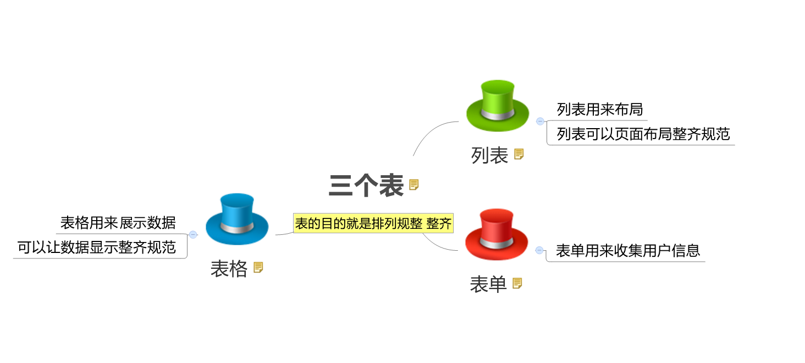
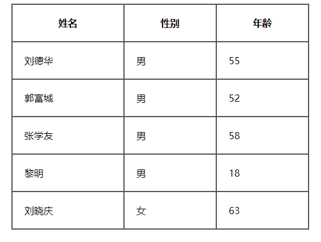
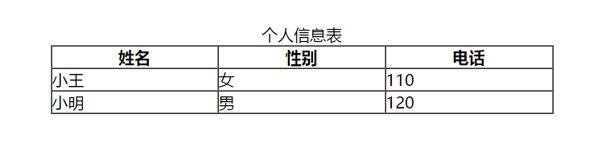

# Day-2
  

# 表格 table
## 创建表格
```html
<table><!-- table用于定义一个表格标签 -->
  <tr><!--tr标签 用于定义表格中的行，必须嵌套在table标签中。-->
    <td>文字</td><!--td 用于定义表格中的单元格，必须嵌套在<tr></tr>标签中。-->
    ...
  </tr>
  ...
</table>
```
  

**总结：**
* 表格的主要目的是用来显示特殊数据的
* 一个完整的表格有表格标签（table），行标签（tr），单元格标签（td）组成，没有列的标签
- `<tr>` `</tr>`中只能嵌套`<td>` `</td>`类的单元格
- `<td>` `</td>`标签，他就像一个容器，可以容纳所有的元素

## 表格属性

  

**案例：**


```html
<table width="500" height="300" border="1" cellpadding="20" cellspacing="0" align="center">
   <tr>  <th>姓名</th>   <th>性别</th> <th>年龄</th>  </tr>
   <tr>  <td>刘德华</td> <td>男</td> <td>55</td>  </tr>
   <tr>  <td>郭富城</td> <td>男</td> <td>52</td>  </tr>
   <tr>  <td>张学友</td> <td>男</td> <td>58</td>  </tr>
   <tr>  <td>黎明</td>   <td>男</td> <td>18</td>  </tr>
   <tr>  <td>刘晓庆</td> <td>女</td> <td>63</td>  </tr>
</table>
```

## 表头单元格标签th
  - 只需用表头标签&lt;th&gt;</th&gt;替代相应的单元格标签&lt;td&gt;</td&gt;即可。 
  - 居中&&加粗

 

**案例**



```html
<table width="500" border="1" align="center" cellspacing="0" cellpadding="0">
		<tr>  
			<th>姓名</th> 
			<th>性别</th>
			<th>电话</th>
		</tr>
		<tr>
			<td>小王</td>
			<td>女</td>
			<td>110</td>
		</tr>
		<tr>
			<td>小明</td>
			<td>男</td>
			<td>120</td>
		</tr>	
	</table>
```

## 表格标题caption
```html
<table>
   <caption>我是表格标题</caption>
</table>
```
1. caption 元素定义**表格标题**，通常这个标题会被居中且显示于表格之上。
2. caption 标签必须紧随 table 标签之后。
3. 这个标签只存在 表格里面才有意义。

## 合并单元格
> **合并的顺序我们按照`先上后下` `先左后右`的顺序 **
* 跨行合并：rowspan="合并单元格的个数"      
* 跨列合并：colspan="合并单元格的个数"  


1. 先确定是跨行还是跨列合并
2. 根据 先上 后下   先左  后右的原则找到目标单元格    然后写上 合并方式 还有 要合并的单元格数量  比如 ： `<td colspan="3">`   `</td>`
3. 删除多余的单元格 单元格  

## 总结表格

| 标签名              | 定义           | 说明                                         |
| ------------------- | :------------- | :------------------------------------------- |
| `<table>` `</table>`     | 表格标签       | 就是一个四方的盒子                           |
| `<tr>` `</tr>`           | 表格行标签     | 行标签要再table标签内部才有意义              |
| `<td>` `</td>`           | 单元格标签     | 单元格标签是个容器级元素，可以放任何东西     |
| `<th>` `</th>`           | 表头单元格标签 | 它还是一个单元格，但是里面的文字会居中且加粗 |
| `<caption>` `</caption>` | 表格标题标签   | 表格的标题，跟着表格一起走，和表格居中对齐   |
| clospan 和 rowspan  | 合并属性       | 用来合并单元格的                             |
## 表格划分结构
1. `<thead>` `</thead>`：用于定义表格的头部。用来放标题之类的东西。`<thead>`内部必须拥有`<tr>`标签！
2. `<tbody>` `</tbody>`：用于定义表格的主体。放数据本体 。
3. `<tfoot>` `</tfoot>`放表格的脚注之类。
4. 以上标签都是放到table标签中。

# 列表标签
## 无序列表 ul
```html
<ul>
  <li>列表项1</li>
  <li>列表项2</li>
  <li>列表项3</li>
  ......
</ul>
```
```
 1. <ul></ul>中只能嵌套<li></li>，直接在<ul></ul>标签中输入其他标签或者文字的做法是不被允许的。
 2. <li>与</li>之间相当于一个容器，可以容纳所有元素。
```
## 有序列表 ol
```html
<ol>
  <li>列表项1</li>
  <li>列表项2</li>
  <li>列表项3</li>
  ......
</ol>
```
## 自定义列表
```html
<dl>
  <dt>名词1</dt>
  <dd>名词1解释1</dd>
  <dd>名词1解释2</dd>
  ...
  <dt>名词2</dt>
  <dd>名词2解释1</dd>
  <dd>名词2解释2</dd>
  ...
</dl>
```
## 列表总结

| 标签名    |     定义     | 说明                                                   |
| --------- | :----------: | :----------------------------------------------------- |
| `<ul>` `</ul>` | **无序标签** | 里面只能包含li    没有顺序，我们以后布局中最常用的列表 |
| `<ol>` `</ol>` |   有序标签   | 里面只能包含li    有顺序， 使用情况较少                |
| `<dl>` `</dl>` |  自定义列表  | 里面有2个兄弟， dt 和 dd                               |
# 表单标签
## input 控件
  ```html
  <input type="属性值" value="你好">
  ```
  - input 输入的意思 
  - `<input />`;标签为单标签
  - type属性设置不同的属性值用来指定不同的控件类型
  - 除了type属性还有别的属性


## type 属性

* 这个属性通过改变值，可以决定了你属于那种input表单。
* 比如`type = 'text'`就表示文本框可以做用户名，昵称等。
* 比如`type = 'password'`就是表示密码框，用户输入的内容是不可见的。

```html
用户名: <input type="text" /> 
密  码：<input type="password" />
```
## value属性值

```html
用户名:<input type="text"  name="username" value="请输入用户名"> 
```
* value 默认的文本值。 有些表单想刚打开页面就默认显示几个文字，就可以通过这个value 来设置。

## 3. name属性
~~~html
用户名:<input type="text"  name=“username” />  
~~~

name表单的名字， 这样，后台可以通过这个name属性找到这个表单。  页面中的表单很多，name主要作用就是用于区别不同的表单。

* name属性后面的值，是我们自己定义的。


* radio  如果是一组，我们必须给他们命名相同的名字 name   这样就可以多个选其中的一个啦

```html
<input type="radio" name="sex"  />男
<input type="radio" name="sex" />女
```
## checked属性
* 表示默认选中状态。较常见于`单选按钮`和`复选按钮`。
```html
性别:
<!-- 默认选择的是男性 -->
<input type="radio" name="sex" value="男" checked="checked" />男
<input type="radio" name="sex" value="女" />女 
```

## input 属性小结
| 属性    | 说明     | 作用                                                   |
| ------- | :------- | ------------------------------------------------------ |
| type    | 表单类型 | 用来指定不同的控件类型                                 |
| value   | 表单值   | 表单里面默认显示的文本                                 |
| name    | 表单名字 | 页面中的表单很多，name主要作用就是用于区别不同的表单。 |
| checked | 默认选中 | 表示那个单选或者复选按钮一开始就被选中了               |

## label标签
**作用：** 

 用于绑定一个表单元素, 当点击label标签的时候, 被绑定的表单元素就会获得输入焦点。
1. 第一种用法就是用label直接包括input表单。（适合单个表单选择）

```html
<label> 用户名： <input type="radio" name="usename" value="请输入用户名">   </label>
```   
2. 第二种用法 for 属性规定 label 与哪个表单元素绑定。

```html
<label for="sex">男</label>
<input type="radio" name="sex"  id="sex">
```
## textarea控件(文本域)
```html
<textarea >
  文本内容
</textarea>
```

- 作用：

  通过textarea控件可以轻松地创建多行文本输入框.

  cols="每行中的字符数" rows="显示的行数"  我们实际开发不用

#### 文本框和文本域区别

| 表单                |  名称  |    区别    |            默认值显示 |       用于场景 |
| :---------------- | :--: | :------: | ---------------: | ---------: |
| input type="text" | 文本框  | 只能显示一行文本 | 单标签，通过value显示默认值 | 用户名、昵称、密码等 |
| textarea          | 文本域  | 可以显示多行文本 |    双标签，默认值写到标签中间 |        留言板 |

## select下拉列表
```html
<select>
  <option>选项1</option>
  <option>选项2</option>
  <option>选项3</option>
  ...
</select>
```

## form表单域

```html
<form action="url地址" method="提交方式" name="表单名称">
  各种表单控件
</form>
```

| 属性     | 属性值      | 作用                          |
| ------ | :------- | --------------------------- |
| action | url地址    | 用于指定接收并处理表单数据的服务器程序的url地址。  |
| method | get/post | 用于设置表单数据的提交方式，其取值为get或post。 |
| name   | 名称       | 用于指定表单的名称，以区分同一个页面中的多个表单。   |