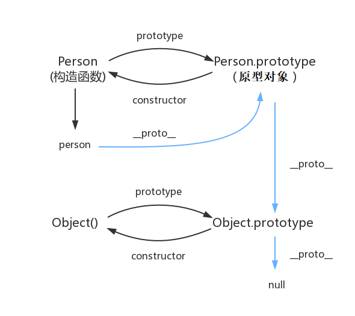
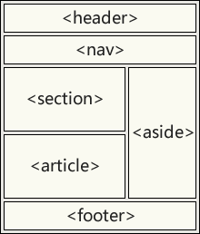

##  浅拷贝与深拷贝
`浅拷贝`（shallowCopy）只是增加了一个指针指向已存在的内存地址，两者的属性值会指向同一内存空间

##### 实现浅拷贝方法
1. 方法一：ES6新增了object.assign()
2. 方法二：展开运算符（…）

`深拷贝`（deepCopy）是增加了一个指针并且申请了一个新的内存，使这个增加的指针指向这个新的内存

##### 实现深拷贝方法
1. JSON.parse（）
2. JSON.Stringify（）


## 闭包，及其如何实现

`闭包`：有权访问另一个函数作用域中变量的函数

在JavaScript垃圾回收机制内，当一个函数被执行完后，其作用域会被回收，但如果形成了闭包，执行完后其作用域不会被回收。

**创建闭包的常见方式**：在一个函数内部创建另一个函数

## 从输入url到页面加载显示完成，中间都经历了什么?
1.  首先，在浏览器地址栏中输入url
2. 浏览器先查看浏览器缓存-系统缓存-路由器缓存，如果缓存中有，会直接在屏幕 中显示页面内容。
3.  在发送http请求前，需要域名解析(DNS解析)解析获取相应的IP地址。
4.  浏览器向服务器发起tcp连接，与浏览器建立tcp三次握手。（TCP即传输控制协议。TCP连接是互联网连接协议集的一种。）
      【1.主机向服务器发送一个建立`连接`的请求（您好，我想认识您）；】
      【2.服务器接到请求后发送同意`连接`的信号（好的，很高兴认识您）；】
      【3.主机接到同意连接的信号后，再次向服务器发送了`确认`信号（我也很高兴认识您），自此，主机与服务器两者建立了连接。】
5.  握手成功后，浏览器向服务器发送http请求，请求数据包。
6.  服务器处理收到的请求，将数据返回至浏览器
7.  浏览器收到HTTP响应
8.  读取页面内容，浏览器渲染，解析html源码
9.  生成Dom树、解析css样式、js交互
10.  客户端和服务器交互
11.  ajax查询

##  JS的基本数据类型有哪些？
基本数据类型：Number、String、Boolean、Null、 Undefined、Symbol（ES6）bigInt（ES10），这些类型可以直接操作保存在变量中的实际值。

引用数据类型：Object（在JS中除了基本数据类型以外的都是对象，数据是对象，函数是对象，正则表达式是对象）

## 面向对象和面向过程的区别
面向过程：为了把大象装进冰箱，需要3个过程。1) 把冰箱门打开（得到打开门的冰箱）2) 把大象装进去（打开门后，得到里面装着大象的冰箱）3) 把冰箱门关上（打开门、装好大象后，获得关好门的冰箱）每个过程有一个阶段性的目标，依次完成这些过程，就能把大象装进冰箱。
面向对象：了把大象装进冰箱，需要做三个动作(行为)每个动作有一个执行者，它就是对象。
1:冰箱.开门()冰箱.装进(大象)冰箱.关门()

## 如何实现一个promise

## 事件流

## session和cookies区别

## 原型链



## 内存泄漏

## JavaScript内存回收机制

## 作用域

## TCP三次握手
## 四次挥手

## https 和 http 的不同之处

## 用 nodejs 做过什么


## This指向

普通函数function(){}中 this默认指向的是window

箭头函数()=>{}中 this默认指向的是【箭头函数没有自己的this值，箭头函数中所使用的this来自于函数作用域链(找父级)。】

## HTML5新特性



### 新增语义化标签

- `<header>`标签通常放在页面或页面某个区域的顶部，用来设置页眉；
- `<nav>`标签可以用来定义导航链接的集合，点击链接可以跳转到其他页面；
- `<article>`标签中的内容比较独立，可以是一篇新闻报道，一篇博客，它可以独立于页面的其他内容进行阅读；
- `<section>`标签表示页面中的一个区域，通常对页面进行分块或对内容进行分段，`<section>`标签和 `<article>`标签可以互相嵌套；
- `<aside>`标签用来表示除页面主要内容之外的内容，比如侧边栏；
- `<footer>`标签位于页面或页面某个区域的底部，用来设置页脚，通常包含版权信息，联系方式等。

### 增强型表单

1.  新的input type 如：**number**、**url**、**email**、**range**、**color**、**date**

2.  新的表单元素
```html5
<input><textarea><select><option>....
<datalist>：数据列表，为input提供输入建议列表
<progress>：进度条，展示连接/下载进度
<meter>：刻度尺/度量衡，描述数据所处的阶段，红色(危险)=>黄色(警告)=>绿色(优秀)
<output>：输出内容，语义上表示此处的数据是经过计算而输出得到的
```

3.  表单元素的新属性

- 通用属性：
  - placeholder：占位提示文字
  -  mutiple：是否允许多个输入
  - autofocus：自动获得输入焦点
  - form：指定输入元素所从属的表单，可以实现输入框放在表单外部并能被提交的效果

- 验证属性(了解即可)：
  -  required：输入框内容不能为空
  - min：允许输入的数字最小值
  -   max：允许输入的数字最大值
  - minlength：允许输入的字符串最小长度
  - maxlength：允许输入的字符串最大长度
  -  pattern：输入框内容必须符合的正则表达式

### 视频和音频

视频播放：<video src=""><video>

```
<audio controls>    //controls属性提供添加播放、暂停和音量控件。
  <source src="horse.ogg" type="audio/ogg">
  <source src="horse.mp3" type="audio/mpeg">
您的浏览器不支持 audio 元素。        //浏览器不支持时显示文字
</audio>
```

音频播放：<audio src=""></audio>

```
<video width="320" height="240" controls>
  <source src="movie.mp4" type="video/mp4">
  <source src="movie.ogg" type="video/ogg">
您的浏览器不支持Video标签。
</video>
```

### Canvas绘图

H5原生技术，基于网页画布2D位图绘图技术，善于表现细腻颜色，可用于统计图表、页面游戏、地图应用、网页特效等。

### SVG
 Scalable Vector Graphic，可缩放向量图

```
Canvas与SVG的不同：
(1)Canvas是位图；SVG是矢量图
(2)Canvas是JS绘图技术(不是DOM元素)；SVG是标签绘图技术(是DOM元素)
(3)Canvas内容不能使用CSS；SVG内容可以使用CSS；
(4)Canvas内容不方便绑定事件处理；SVG内容方便进行事件绑定
```

### 拖放API

| 拖动生命周期 | 属性名      | 描述                                           |
| ------------ | ----------- | ---------------------------------------------- |
| 拖动开始     | ondragstart | 在拖动操作开始时执行脚本                       |
| 拖动过程中   | ondrag      | 只要脚本在被拖动就运行脚本                     |
| 拖动过程中   | ondragenter | 当元素被拖动到一个合法的防止目标时，执行脚本   |
| 拖动过程中   | ondragover  | 只要元素正在合法的防止目标上拖动时，就执行脚本 |
| 拖动过程中   | ondragleave | 当元素离开合法的防止目标时                     |
| 拖动结束     | ondrop      | 将被拖动元素放在目标元素内时运行脚本           |
| 拖动结束     | ondragend   | 在拖动操作结束时运行脚本                       |

-  注意：拖放API事件句柄中所有的事件对象都有一个dataTransfer属性（数据运输对象），用于在源对象和目标对象间传递数据。
  -   源对象：event.dataTransfer.setData(key, value)
  -   目标对象：var value = event.dataTransfer.getData(key)

### WebStorage

 **(1)服务器端存储**

- 数据库存储，如商品、用户等核心数据

- Session/内存存储，如用户的登录信息

**(2)客户端存储**

- Cookie存储，如用户偏好、访问历史，浏览器兼容性好但处理麻烦且容量限制

- H5 WebStorage存储，如用户偏好、访问历史等安全要求的数据，老IE不兼容但易使用且容量大

**H5WebStorage存储具体涉及到两个对象：**

(1)window.sessionStorage：类数组对象，通过key=>value对存储字符串数据——会话级存储

```
sessionStorage.setItem("name", "James")		//存储
var name = sessionStorage.getItem("name")   //获取
sessionStorage.removeItem('name') 			//删除
sessionStorage.clear()						//清除所有
```

(2)window.localStorage：类数组对象，通过key=>value对存储字符串数据——本地/跨会话级/永久存储

```
localStorage.setItem("name", "James")		//存储
var name = localStorage.getItem("name")   	//获取
localStorage.removeItem('name') 			//删除
localStorage.clear()						//清除所有
```


## CSS3新特性

### 盒子模型

普通盒子模型：box-sizing: content-box; 

- 会因为padding和border值撑大盒子

CSS3盒子模型:box-sizing: border-box;

- 不会因为padding和border值撑大盒子（盒子大小不变）

### 属性选择器

```
        /* 属性选择器的权重是10 */
        button[disabled] {
            cursor: not-allowed;
        }
        
        input[type="text"] {
            color: pink;
        }
        /*以icon开头的变成红色*/
        div[class^="icon"] {
            color: red;
        }
        /*中间含有ccoonn的*/
        div[class*="ccoonn"] {
            color: green;
        }
    </style>
</head>

<body>
    <button>提交</button>
    <button>提交</button>
    <button disabled="disabled">提交</button>
    <button disabled="disabled">提交</button>
    <input type="text" name="" id="" value="请输入文字">
    <input type="text" name="" id="" value="请输入文字">
    <input type="text" name="" id="" value="请输入文字">
    <div class="icon1">图标1</div>
    <div class="icon2">图标2</div>
    <div class="icon3">图标3</div>
    <div class="1iccoonn">图标4</div>
    <div class="2iccoonn">图标4</div>
    <div class="3iccoonn">图标4</div>
```

### 伪类选择器

```
       /* 伪类选择器的权重是10 */
       ul li:first-child {
            background-color: pink;
        }
        
        ul li:last-child {
            background-color: purple;
        }
        
        ul li:nth-child(5) {
            background-color: blue;
        }
        
        ul li:nth-child(2n) {
            background-color: black;
        }
        
        ul li:nth-child(-n+5) {
            background-color: yellow;
        }
        
        div span:first-of-type {
            background-color: tomato;
        }
        
        div span:last-of-type {
            background-color: red;
        }
        
        div span:nth-last-of-type(2) {
            background-color: skyblue;
        }
```


### CSS3 边框

- border-radius（圆角）

- box-shadow

- border-image（边界图片）

### 背景

- background-image
- background-size
- background-origin（规定背景图片的定位区域）
- background-clip（规定背景的绘制区域）

### 渐变

- 线性渐变（Linear Gradients）- 向下/向上/向左/向右/对角方向
- 径向渐变（Radial Gradients）- 由它们的中心定义

###  文本效果

- text-shadow

- box-shadow

- text-overflow（文本溢出属性指定应向用户如何显示溢出内容ellipsis[溢出显示...]）

  ```
  white-space:nowrap;			//强制一行显示
  overflow:hidden; 			//溢出隐藏
  text-overflow:ellipsis; 	//溢出内容显示...
  ```

- word-wrap（允许对长单词进行拆分，并换行到下一行）

  ```
  p {
  word-wrap:break-word;
  }
  ```
  
### 2D转换

- translate()

  - translate()方法，根据左(X轴)和顶部(Y轴)位置给定的参数，从当前元素位置移动

- rotate()

  - rotate()方法，在一个给定度数顺时针旋转的元素。负值是允许的，这样是元素逆时针旋转。

- scale()

  - scale()方法，该元素增加或减少的大小，取决于宽度（X轴）和高度（Y轴）的参数：

- skew()

  ```
  transform:skew(<angle> [,<angle>]);
  ```

  包含两个参数值，分别表示X轴和Y轴倾斜的角度，如果第二个参数为空，则默认为0，参数为负表示向相反方向倾斜。

  - skewX(<angle>);表示只在X轴(水平方向)倾斜。
  - skewY(<angle>);表示只在Y轴(垂直方向)倾斜。

### 3D转换
- perspective （透视效果）
- 3D呈现 transform-style:preserve-3d（开启3D）;
  - 代码写给父级，影响子盒子

| 函数                          | 描述                                      |
| ----------------------------- | ----------------------------------------- |
| translate3d(*x*,*y*,*z*)      | 定义 3D 转化。                            |
| translateX(*x*)               | 定义 3D 转化，仅使用用于 X 轴的值。       |
| translateY(*y*)               | 定义 3D 转化，仅使用用于 Y 轴的值。       |
| translateZ(*z*)               | 定义 3D 转化，仅使用用于 Z 轴的值。       |
| scale3d(*x*,*y*,*z*)          | 定义 3D 缩放转换。                        |
| scaleX(*x*)                   | 定义 3D 缩放转换，通过给定一个 X 轴的值。 |
| scaleY(*y*)                   | 定义 3D 缩放转换，通过给定一个 Y 轴的值。 |
| scaleZ(*z*)                   | 定义 3D 缩放转换，通过给定一个 Z 轴的值。 |
| rotate3d(*x*,*y*,*z*,*angle*) | 定义 3D 旋转。                            |
| rotateX(*angle*)              | 定义沿 X 轴的 3D 旋转。                   |
| rotateY(*angle*)              | 定义沿 Y 轴的 3D 旋转。                   |
| rotateZ(*angle*)              | 定义沿 Z 轴的 3D 旋转。                   |

### 过渡（transition）

```
 transition: all 2s;
```

### 动画（@keyframes）

```
@keyframes move {
	0% {
		transform: translateX(0px);
		}
	100% {
		transform: translateX(1200px);
		}
}

div {
	width: 200px;
	height: 200px;
	background-color: pink;
	animation-name: move;		//动画名字
	animation-duration: 20s;	//动画持续时间
}
```


## ES6新特性

### const和let

let声明局部变量

const表示声明常量

两者都为块级作用域

### 模板字符串

反引号(``)直接搞定

### 箭头函数

```
(参数)=>{
	
}
```

- 不需要 function 关键字来创建函数
- 省略 return 关键字
- 继承当前上下文的 this 关键字


### super()方法


### for...in遍历

```
obj={
	name:'zs',
	age:'18'
}

for(var key in obj){
	console.log(key);			//key指的是属性名
	console.log(obj[key]);		//obj[key]是对应的值
}
```

### class

